# Architecture

This document describes the architecture, flows, and components of **certificate-validate**,
a modern, extensible SSL/TLS validation tool written in Go.

---

## Table of Contents

1. [Architecture Overview](#1-architecture-overview)
2. [CLI Command Hierarchy](#2-cli-command-hierarchy)
3. [Certificate Check Flow](#3-certificate-check-flow)
4. [HTTP Request Flow (API)](#4-http-request-flow-api)
5. [Background Services](#5-background-services)
6. [Configuration Loading Pipeline](#6-configuration-loading-pipeline)
7. [Dependency Injection and Initialization](#7-dependency-injection-and-initialization)
8. [Data Export](#8-data-export)
9. [Revocation Check](#9-revocation-check)

---

## 1. Architecture Overview

The project follows **Clean Architecture** with **SOLID** principles,
separating the code into concentric layers:

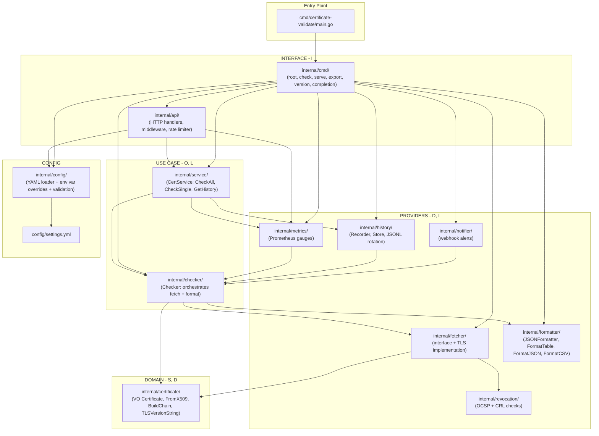

### SOLID Principles Applied

| Principle | Implementation |
|---|---|
| **S** - Single Responsibility | Each package has a single responsibility: `certificate` = domain, `fetcher` = TLS, `formatter` = output, `checker` = orchestration |
| **O** - Open/Closed | `Fetcher` and `Formatter` interfaces allow new implementations without modifying existing code |
| **L** - Liskov Substitution | Explicit `(Certificate, error)` returns — no `sys.Exit()` or inconsistent types |
| **I** - Interface Segregation | Minimal interfaces: `Fetcher` has 1 method, `Formatter` has 1 method |
| **D** - Dependency Inversion | `checker` defines interfaces, providers implement them. `main.go` injects dependencies |

---

## 2. CLI Command Hierarchy

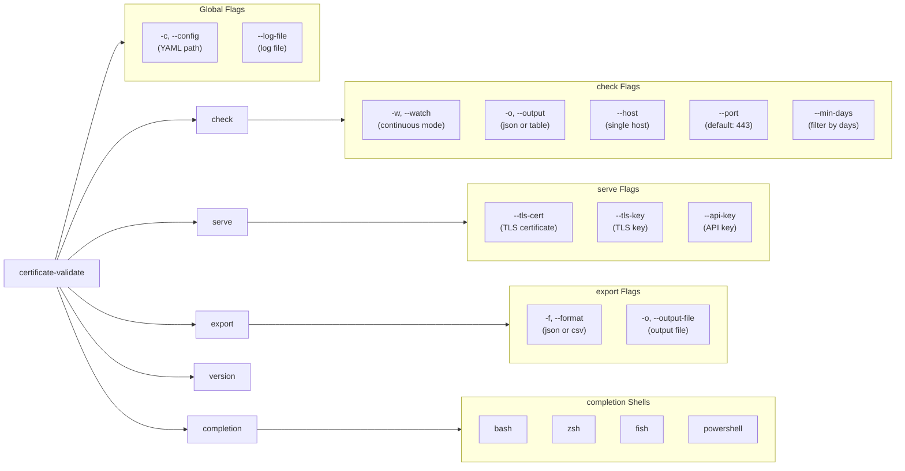

### How Each Command Works

| Command | Description | Main Flow |
|---|---|---|
| `check` | Checks certificates from configured hosts or a single host via `--host` | Loads config → builds `Checker` via `buildApp` → `CheckAll`/`Check` → filters by `--min-days` → prints JSON or table |
| `check --watch` | Continuous check loop with configurable interval | `signal.NotifyContext` → loop with `time.Sleep(checkTime)` → checks and prints → restarts |
| `serve` | Starts HTTP/HTTPS server with hot-reload via SIGHUP | Loads config → `buildDeps` (injects everything) → mux with routes + middleware → background services → waits for SIGHUP or SIGTERM |
| `export` | Checks all hosts and exports in JSON or CSV | Loads config → `buildApp` → `CheckAll` → `FormatJSON`/`FormatCSV` → stdout or file |
| `version` | Shows version, commit, build date, and Go runtime | Prints variables injected via `ldflags` |
| `completion` | Generates shell completion script | Delegates to `cobra.Gen*Completion` |

---

## 3. Certificate Check Flow

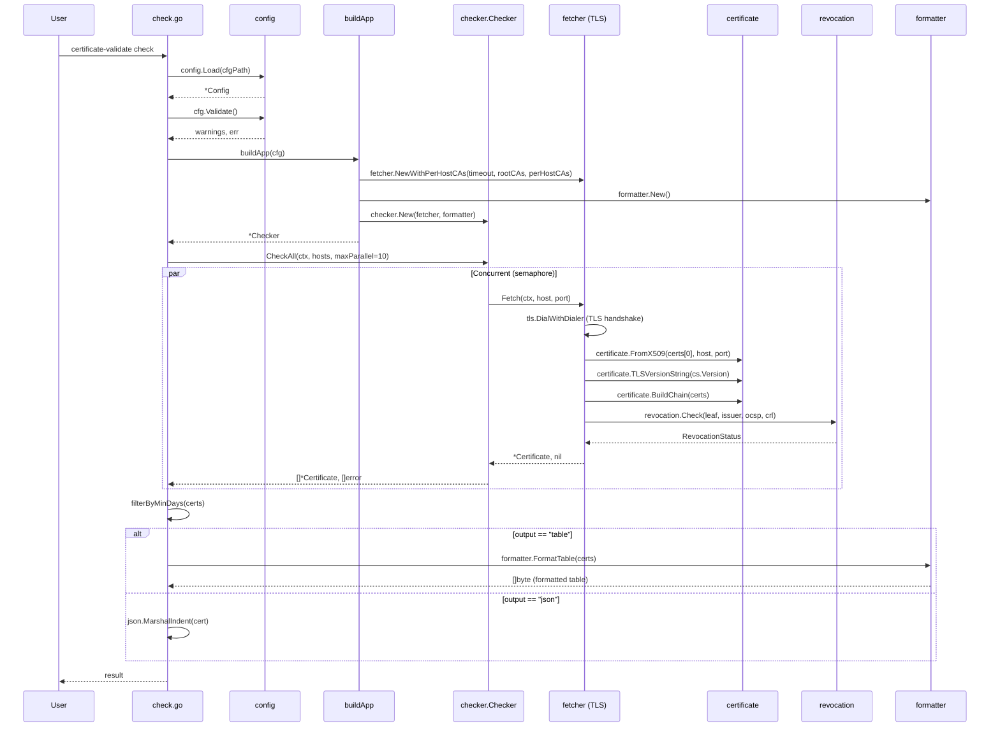

### Detailed Check Steps

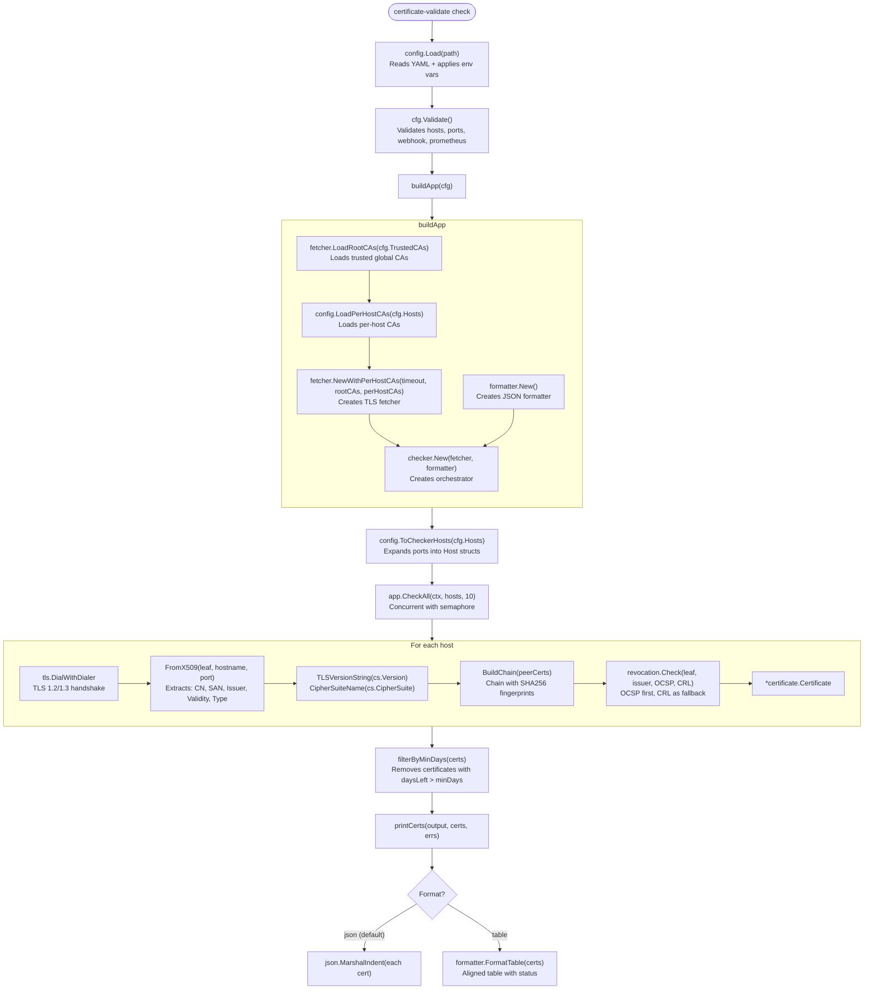

---

## 4. HTTP Request Flow (API)

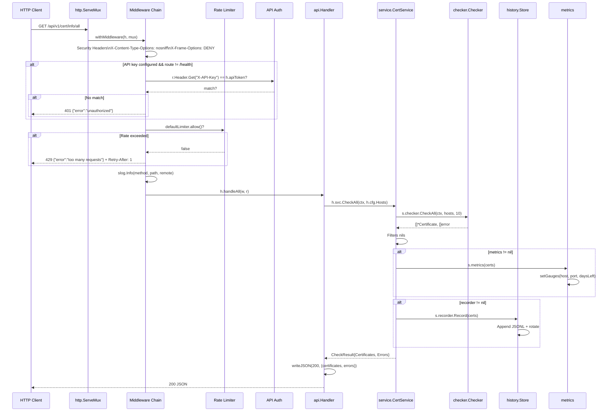

### API Routes

| Method | Route | Handler | Description |
|---|---|---|---|
| GET | `/health` | `handleHealth` | Health check with TCP ping to each host |
| GET | `/api/v1/cert/info/all` | `handleAll` | Certificates from all hosts |
| GET | `/api/v1/cert/info/{hostname}` | `handleByHostname` | Certificate for a specific host |
| GET | `/api/v1/cert/info/commonName` | `handleCommonName` | Map hostname → Common Name |
| GET | `/api/v1/cert/info/subjectAltName` | `handleSubjectAltName` | Map hostname → SANs |
| GET | `/api/v1/cert/export/json` | `handleExportJSON` | Download JSON of all certificates |
| GET | `/api/v1/cert/export/csv` | `handleExportCSV` | Download CSV of all certificates |
| GET | `/api/v1/cert/history/{hostname}` | `handleHistory` | Check history for a host |
| GET | `/metrics` | `metrics.Handler()` | Prometheus metrics (if enabled) |
| GET | `/` | `http.FileServer(staticFS)` | Embedded static frontend |

### Middleware Chain

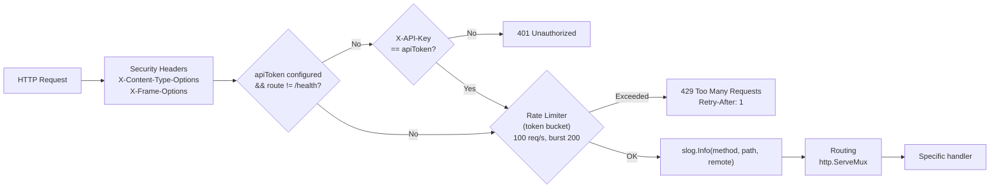

### Rate Limiter (Token Bucket)


---

## 5. Background Services

When the `serve` server is running, three concurrent services may operate in the background:

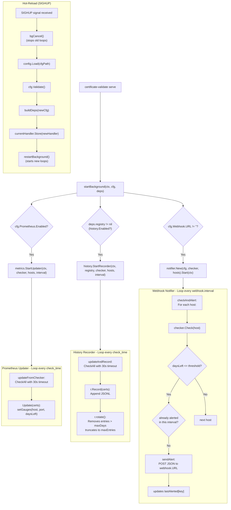

### Service Details

| Service | Activation | Interval | Function |
|---|---|---|---|
| **Prometheus Updater** | `prometheus.enabled: true` | `check_time` | Checks all hosts and updates the `certificate_days_left` and `certificate_expired` gauges |
| **History Recorder** | `history.enabled: true` | `check_time` | Checks all hosts and records a JSONL entry with automatic rotation (max_days + max_entries) |
| **Webhook Notifier** | `webhook.url` set | `webhook.interval` | Checks each host individually and sends a POST alert if `daysLeft <= threshold`, with its own rate limiting |

---

## 6. Configuration Loading Pipeline

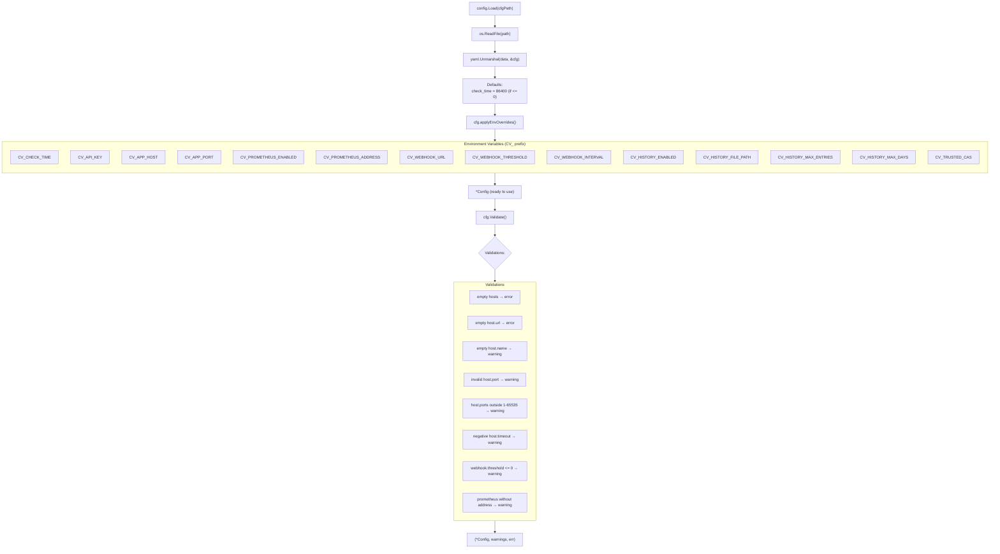

### Config Structure

```yaml
check_time: 30                    # Check interval in seconds
api_key: "..."                    # API key for authentication

app_configs:                      # HTTP server configuration
  - host: '0.0.0.0'
    port: '5000'
    environment: 'production'
    debug: false

hosts:                            # Hosts to check certificates
  - name: "GitHub"
    url: 'github.com'
    port: '443'
    ports: [443]                  # Multiple ports (alternative to port)
    timeout: 10                   # Per-host timeout (seconds)
    trusted_cas:                  # Per-host CAs
      - '/certs/internal-ca.pem'

prometheus:                       # Prometheus metrics
  enabled: false
  address: ':9090'

webhook:                          # Webhook alerts
  url: 'https://hooks.example.com/alert'
  threshold: 15                   # Minimum days to alert
  interval: 1800                  # Interval between checks (seconds)

history:                          # Local history (JSONL)
  enabled: true
  file_path: "data/history.jsonl"
  max_entries: 10000
  max_days: 90

trusted_cas:                      # Trusted global CAs
  - '/etc/certs/my-ca.pem'
```

---

## 7. Dependency Injection and Initialization

### `serve` — Full Initialization

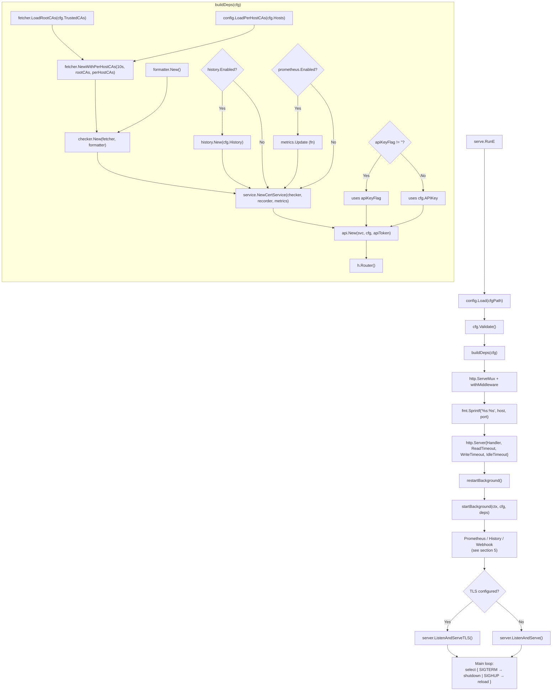

### `check` — Simplified Initialization

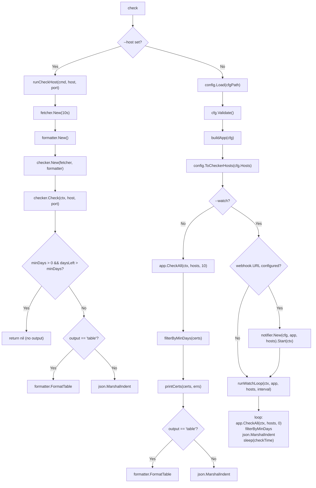

---

## 8. Data Export

```mermaid
flowchart TB
    subgraph CLI["Export via CLI"]
        cli["certificate-validate export"] --> loadCfg["config.Load(cfgPath)"]
        loadCfg --> buildApp["buildApp(cfg)"]
        buildApp --> checkAll["app.CheckAll(ctx, hosts, 10)"]
        checkAll --> formatChoice{"Format?"}
        formatChoice -->|"json (default)"| fmtJSON["formatter.FormatJSON(certs)\n[]byte JSON array"]
        formatChoice -->|"csv"| fmtCSV["formatter.FormatCSV(certs)\n[]byte CSV with header"]
        fmtJSON --> output{"--output-file?"}
        fmtCSV --> output
        output -->|"Yes"| file["os.WriteFile(path, data, 0644)"]
        output -->|"No"| stdout["fmt.Println(string(data))"]
    end

    subgraph API["Export via API"]
        apiJson["GET /api/v1/cert/export/json"] --> svcAll["svc.CheckAll(ctx, hosts)"]
        svcAll --> jsonResp["writeJSON(200, {certificates, errors})\nContent-Disposition: attachment"]
        svcAll --> csvHeader["Content-Type: text/csv\nBOM UTF-8\nContent-Disposition: attachment"]
        csvHeader --> csvWrite["csv.NewWriter:\nwrites header + rows"]
    end

    subgraph Formats["Output Formats"]
        direction TB
        f1["FormatJSON:\njson.MarshalIndent(certs, '', '  ')"]
        f2["FormatCSV:\ncsv.Writer with header:\nhostname,port,commonName,issuer,\nnotBefore,notAfter,daysLeft,\nrevocationStatus,tlsVersion,cipherSuite"]
        f3["FormatTable (CLI only):\nTable with columns:\nHost, Port, Days, Status, Revoc,\nIssuer, TLS Version"]
        f4["Individual JSON:\njson.MarshalIndent(cert, '', '  ')"]
    end

    Formats --> f1
    Formats --> f2
    Formats --> f3
    Formats --> f4
```

### Formatting Differences

| Format | Where | Output |
|---|---|---|
| `FormatJSON` | CLI `export -f json` | `[{...}, {...}]` — array of certificates |
| `FormatCSV` | CLI `export -f csv` | CSV with header + 10 columns |
| `FormatTable` | CLI `check -o table` | Aligned table with colored status |
| Individual JSON | CLI `check` (default) | One JSON object per certificate |

---

## 9. Revocation Check

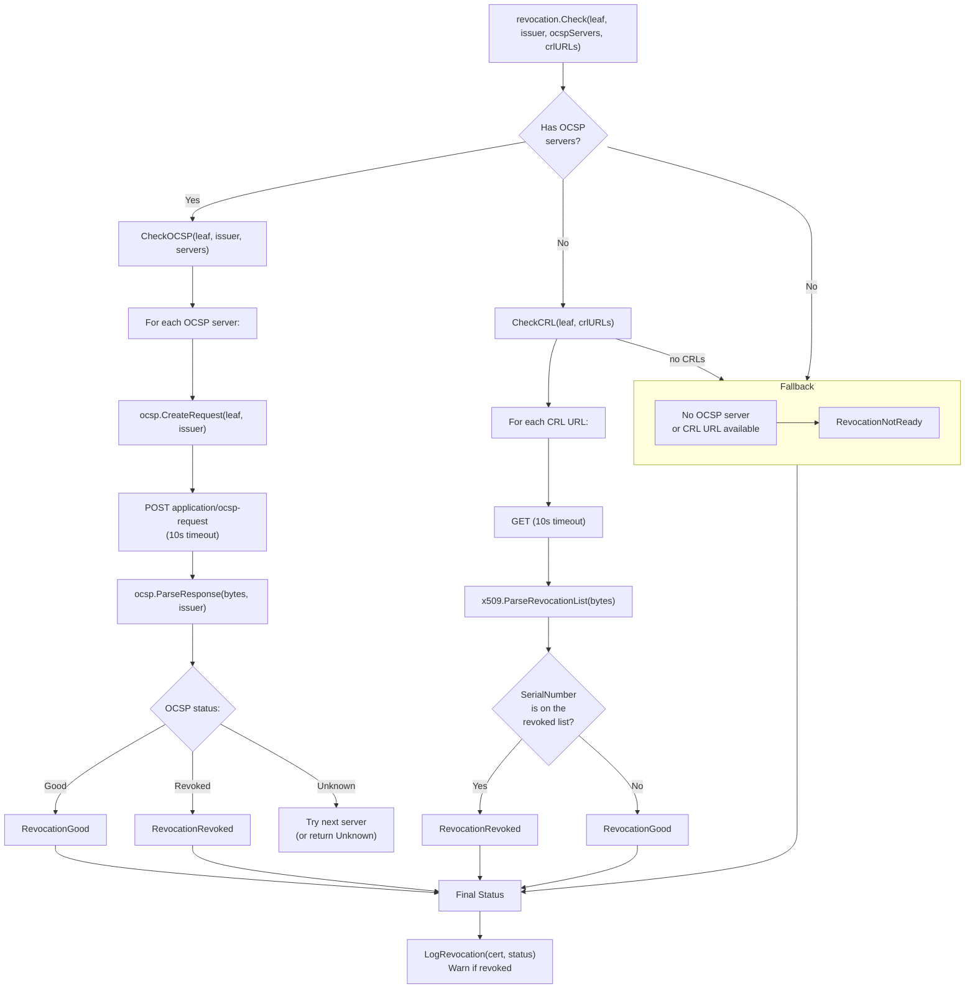

### Check Priority

1. **OCSP** (Online Certificate Status Protocol) — primary attempt, faster and more accurate
2. **CRL** (Certificate Revocation List) — fallback when OCSP is unavailable or returns `NotReady`
3. **NotReady** — when the certificate has no OCSP servers or CRL URLs

---

## Data Model — Certificate

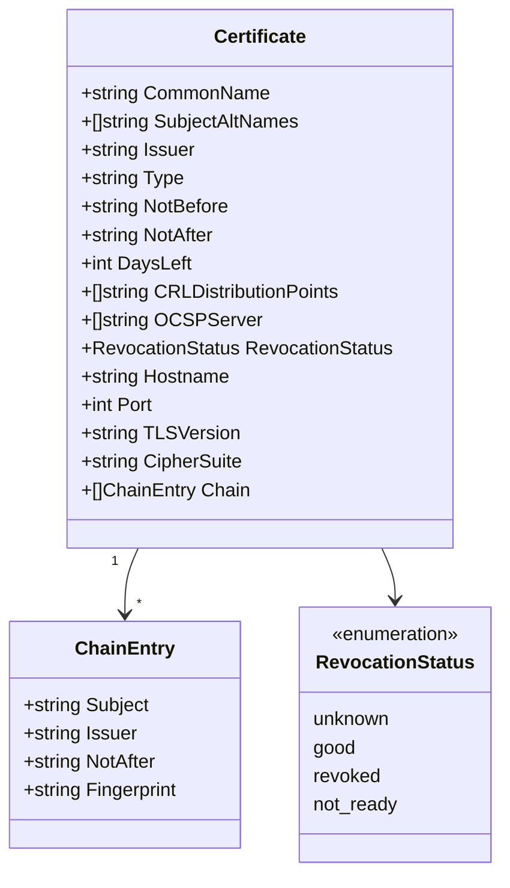

---

## Directory Structure

```
certificate-validate/
├── cmd/certificate-validate/
│   └── main.go                    # Entry point
├── config/
│   └── settings.yml               # YAML configuration
├── docs/
│   ├── swagger.yaml               # OpenAPI 3.0
│   └── ARCHITECTURE.md            # This document
├── internal/
│   ├── api/                       # HTTP interface
│   │   ├── api.go                 # Handlers + middleware + rate limiter
│   │   └── static/                # Embedded frontend (embed)
│   ├── certificate/               # Domain
│   │   ├── certificate.go         # VO + FromX509 + BuildChain
│   │   └── errors.go              # Domain errors
│   ├── checker/                   # Use case
│   │   └── checker.go             # Checker (orchestration)
│   ├── cmd/                       # CLI (Cobra)
│   │   ├── root.go                # Root command + global flags
│   │   ├── check.go               # check + watch
│   │   ├── serve.go               # serve + buildDeps + startBackground
│   │   ├── export.go              # export JSON/CSV
│   │   └── version.go             # version
│   ├── config/                    # Configuration
│   │   └── config.go              # Load + Validate + applyEnvOverrides
│   ├── fetcher/                   # TLS provider
│   │   └── fetcher.go             # Fetcher interface + tlsFetcher
│   ├── formatter/                 # Formatting provider
│   │   └── formatter.go           # Formatter, FormatTable, FormatJSON, FormatCSV
│   ├── history/                   # History
│   │   └── history.go             # Store, Recorder, JSONL rotation
│   ├── metrics/                   # Prometheus metrics
│   │   └── metrics.go             # Gauges + Handler
│   ├── notifier/                  # Webhook
│   │   └── notifier.go            # Notifier + alerts
│   ├── revocation/                # Revocation
│   │   └── revocation.go          # OCSP + CRL checks
│   └── service/                   # Service (facade)
│       └── service.go             # CertService
├── Dockerfile
├── docker-compose.yml
├── Makefile
└── README.md
```
