# Architecture

Este documento descreve a arquitetura, fluxos e componentes do **certificate-validate**,
uma ferramenta moderna e extensível de validação SSL/TLS escrita em Go.

---

## Índice

1. [Visão Geral da Arquitetura](#1-visão-geral-da-arquitetura)
2. [Hierarquia de Comandos CLI](#2-hierarquia-de-comandos-cli)
3. [Fluxo de Checagem de Certificado](#3-fluxo-de-checagem-de-certificado)
4. [Fluxo de Requisição HTTP (API)](#4-fluxo-de-requisição-http-api)
5. [Serviços de Background](#5-serviços-de-background)
6. [Pipeline de Carregamento de Configuração](#6-pipeline-de-carregamento-de-configuração)
7. [Injeção de Dependências e Inicialização](#7-injeção-de-dependências-e-inicialização)
8. [Exportação de Dados](#8-exportação-de-dados)
9. [Checagem de Revogação](#9-checagem-de-revogação)

---

## 1. Visão Geral da Arquitetura

O projeto segue **Clean Architecture** com princípios **SOLID**,
separando o código em camadas concêntricas:


### Princípios SOLID Aplicados

| Princípio | Implementação |
|---|---|
| **S** - Single Responsibility | Cada pacote tem uma responsabilidade: `certificate` = domínio, `fetcher` = TLS, `formatter` = saída, `checker` = orquestração |
| **O** - Open/Closed | Interfaces `Fetcher` e `Formatter` permitem novas implementações sem modificar código existente |
| **L** - Liskov Substitution | Retornos explícitos `(Certificate, error)` — sem `sys.Exit()` ou tipos inconsistentes |
| **I** - Interface Segregation | Interfaces mínimas: `Fetcher` tem 1 método, `Formatter` tem 1 método |
| **D** - Dependency Inversion | `checker` define interfaces, providers implementam. `main.go` injeta dependências |

---

## 2. Hierarquia de Comandos CLI

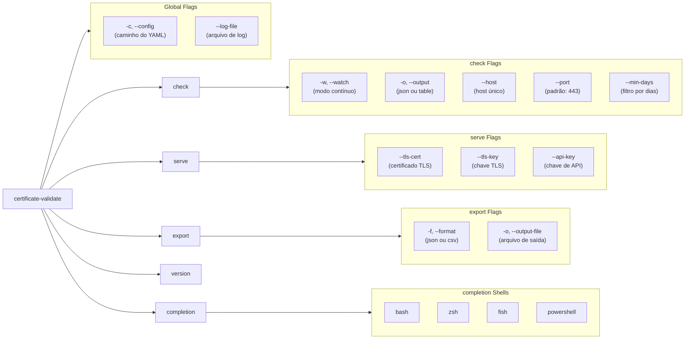

### Funcionamento de Cada Comando

| Comando | Descrição | Fluxo Principal |
|---|---|---|
| `check` | Checa certificados dos hosts configurados ou de um host único via `--host` | Carrega config → constrói `Checker` via `buildApp` → `CheckAll`/`Check` → filtra por `--min-days` → imprime JSON ou tabela |
| `check --watch` | Loop contínuo de checagem com intervalo configurável | `signal.NotifyContext` → loop com `time.Sleep(checkTime)` → checa e imprime → reinicia |
| `serve` | Inicia servidor HTTP/HTTPS com hot-reload via SIGHUP | Carrega config → `buildDeps` (injeta tudo) → mux com rotas + middleware → background services → aguarda SIGHUP ou SIGTERM |
| `export` | Checa todos os hosts e exporta em JSON ou CSV | Carrega config → `buildApp` → `CheckAll` → `FormatJSON`/`FormatCSV` → stdout ou arquivo |
| `version` | Exibe versão, commit, data de build e runtime Go | Imprime vars injetadas via `ldflags` |
| `completion` | Gera script de completão para shell | Delega para `cobra.Gen*Completion` |

---

## 3. Fluxo de Checagem de Certificado

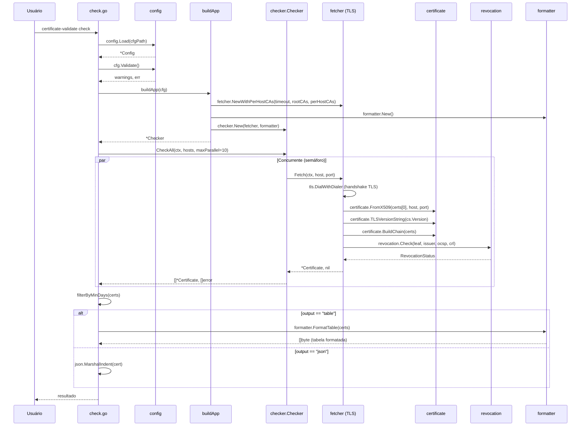

### Etapas Detalhadas da Checagem

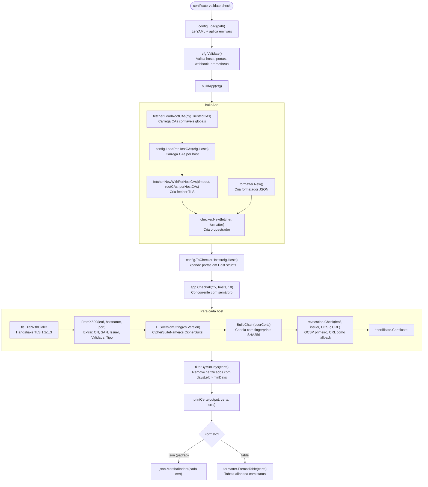

---

## 4. Fluxo de Requisição HTTP (API)

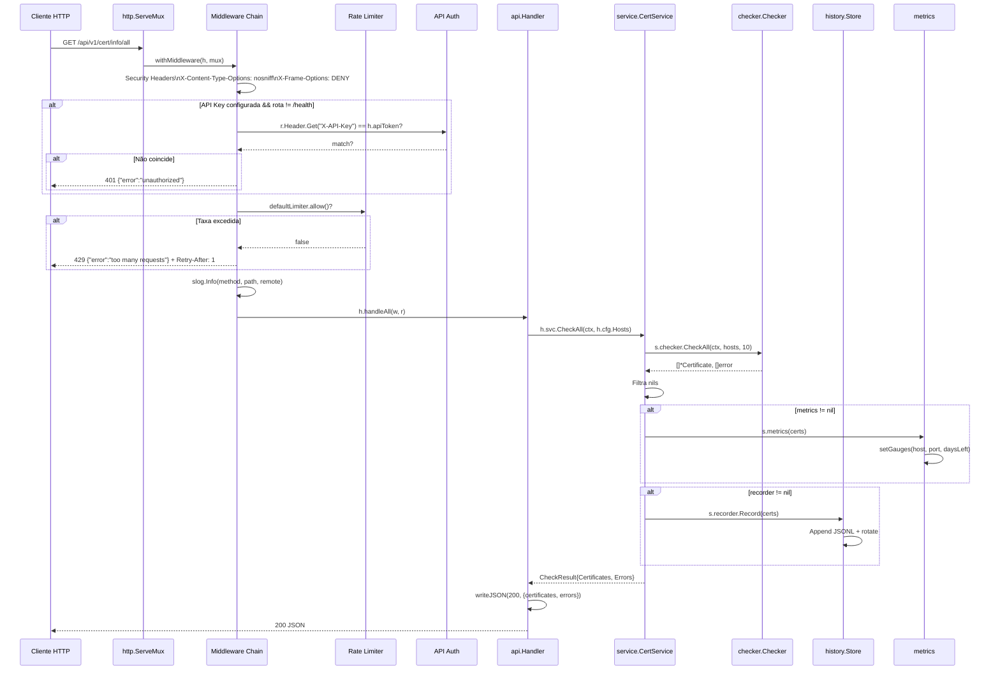

### Rotas da API

| Método | Rota | Handler | Descrição |
|---|---|---|---|
| GET | `/health` | `handleHealth` | Health check com ping TCP em cada host |
| GET | `/api/v1/cert/info/all` | `handleAll` | Certificados de todos os hosts |
| GET | `/api/v1/cert/info/{hostname}` | `handleByHostname` | Certificado de um host específico |
| GET | `/api/v1/cert/info/commonName` | `handleCommonName` | Mapa hostname → Common Name |
| GET | `/api/v1/cert/info/subjectAltName` | `handleSubjectAltName` | Mapa hostname → SANs |
| GET | `/api/v1/cert/export/json` | `handleExportJSON` | Download JSON de todos certificados |
| GET | `/api/v1/cert/export/csv` | `handleExportCSV` | Download CSV de todos certificados |
| GET | `/api/v1/cert/history/{hostname}` | `handleHistory` | Histórico de checagens de um host |
| GET | `/metrics` | `metrics.Handler()` | Métricas Prometheus (se habilitado) |
| GET | `/` | `http.FileServer(staticFS)` | Frontend estático embutido |

### Middleware Chain

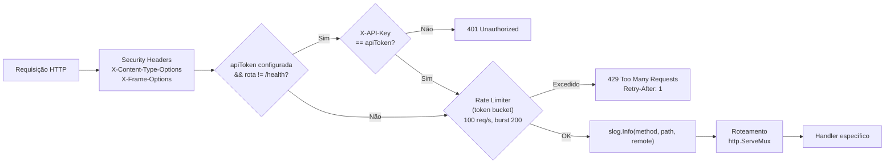

### Rate Limiter (Token Bucket)

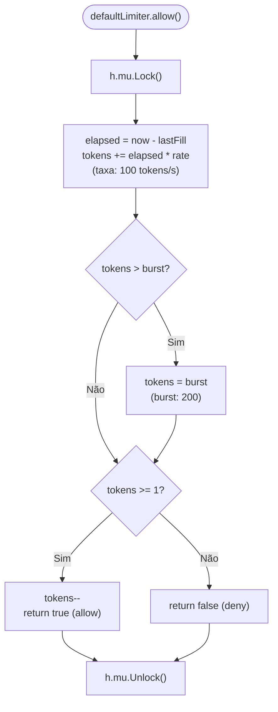

---

## 5. Serviços de Background

Quando o servidor `serve` está rodando, três serviços concorrentes podem operar em background:

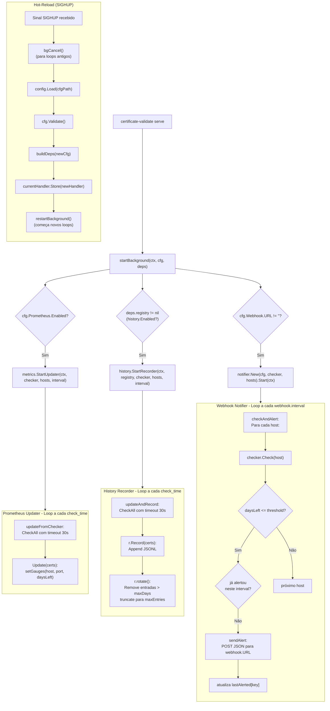

### Detalhamento dos Serviços

| Serviço | Ativação | Intervalo | Função |
|---|---|---|---|
| **Prometheus Updater** | `prometheus.enabled: true` | `check_time` | Checa todos os hosts e atualiza gauges `certificate_days_left` e `certificate_expired` |
| **History Recorder** | `history.enabled: true` | `check_time` | Checa todos os hosts e registra entrada JSONL com rotação automática (max_dias + max_entries) |
| **Webhook Notifier** | `webhook.url` definido | `webhook.interval` | Checa cada host individualmente e envia alerta POST se `daysLeft <= threshold`, com rate limiting próprio |

---

## 6. Pipeline de Carregamento de Configuração

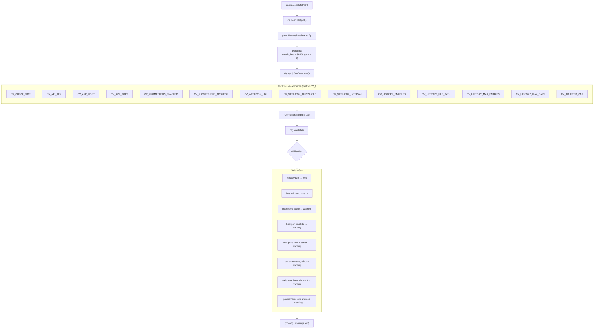

### Estrutura do Config

```yaml
check_time: 30                    # Intervalo de checagem em segundos
api_key: "..."                    # Chave de API para autenticação

app_configs:                      # Configuração do servidor HTTP
  - host: '0.0.0.0'
    port: '5000'
    environment: 'production'
    debug: false

hosts:                            # Hosts para checar certificados
  - name: "GitHub"
    url: 'github.com'
    port: '443'
    ports: [443]                  # Múltiplas portas (alternativa a port)
    timeout: 10                   # Timeout específico por host (segundos)
    trusted_cas:                  # CAs específicas por host
      - '/certs/internal-ca.pem'

prometheus:                       # Métricas Prometheus
  enabled: false
  address: ':9090'

webhook:                          # Alertas via webhook
  url: 'https://hooks.example.com/alert'
  threshold: 15                   # Dias mínimos para alertar
  interval: 1800                  # Intervalo entre checagens (segundos)

history:                          # Histórico local (JSONL)
  enabled: true
  file_path: "data/history.jsonl"
  max_entries: 10000
  max_days: 90

trusted_cas:                      # CAs confiáveis globais
  - '/etc/certs/my-ca.pem'
```

---

## 7. Injeção de Dependências e Inicialização

### `serve` — Inicialização Completa

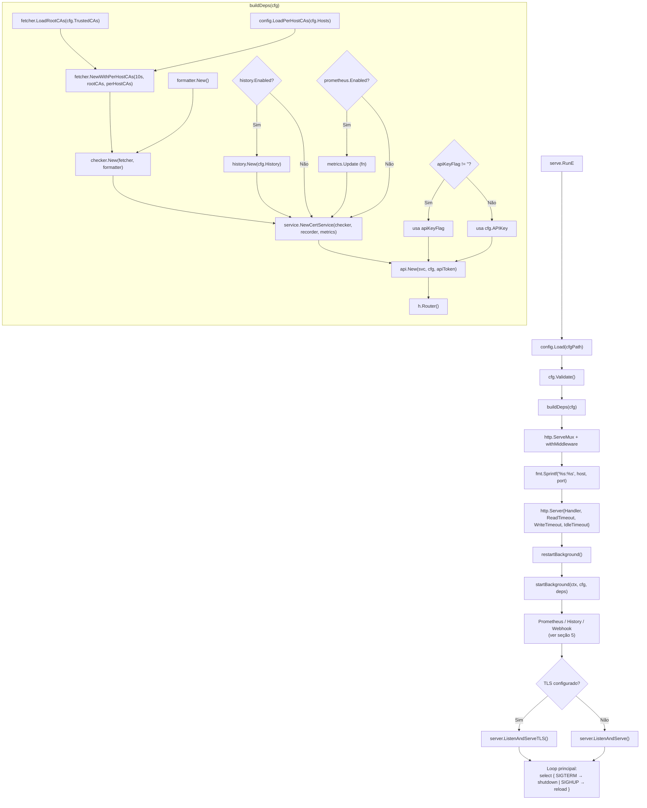

### `check` — Inicialização Simplificada

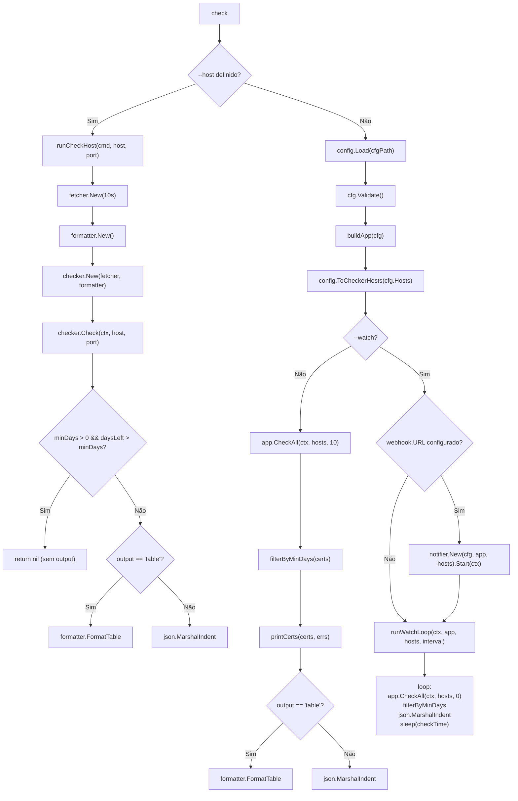

---

## 8. Exportação de Dados

```mermaid
flowchart TB
    subgraph CLI["Export via CLI"]
        cli["certificate-validate export"] --> loadCfg["config.Load(cfgPath)"]
        loadCfg --> buildApp["buildApp(cfg)"]
        buildApp --> checkAll["app.CheckAll(ctx, hosts, 10)"]
        checkAll --> formatChoice{"Formato?"}
        formatChoice -->|"json (padrão)"| fmtJSON["formatter.FormatJSON(certs)\n[]byte JSON array"]
        formatChoice -->|"csv"| fmtCSV["formatter.FormatCSV(certs)\n[]byte CSV com header"]
        fmtJSON --> output{"--output-file?"}
        fmtCSV --> output
        output -->|"Sim"| file["os.WriteFile(path, data, 0644)"]
        output -->|"Não"| stdout["fmt.Println(string(data))"]
    end

    subgraph API["Export via API"]
        apiJson["GET /api/v1/cert/export/json"] --> svcAll["svc.CheckAll(ctx, hosts)"]
        svcAll --> jsonResp["writeJSON(200, {certificates, errors})\nContent-Disposition: attachment"]
        svcAll --> csvHeader["Content-Type: text/csv\nBOM UTF-8\nContent-Disposition: attachment"]
        csvHeader --> csvWrite["csv.NewWriter:\nescreve header + linhas"]
    end

    subgraph Formats["Formatos de Saída"]
        direction TB
        f1["FormatJSON:\njson.MarshalIndent(certs, '', '  ')"]
        f2["FormatCSV:\ncsv.Writer com header:\nhostname,port,commonName,issuer,\nnotBefore,notAfter,daysLeft,\nrevocationStatus,tlsVersion,cipherSuite"]
        f3["FormatTable (CLI only):\nTabela com colunas:\nHost, Port, Days, Status, Revoc,\nIssuer, TLS Version"]
        f4["JSON individual:\njson.MarshalIndent(cert, '', '  ')"]
    end

    Formats --> f1
    Formats --> f2
    Formats --> f3
    Formats --> f4
```

### Diferenças de Formatação

| Formato | Onde | Saída |
|---|---|---|
| `FormatJSON` | CLI `export -f json` | `[{...}, {...}]` — array de certificados |
| `FormatCSV` | CLI `export -f csv` | CSV com header + 10 colunas |
| `FormatTable` | CLI `check -o table` | Tabela alinhada com status colorido |
| JSON individual | CLI `check` (padrão) | Um JSON object por certificado |

---

## 9. Checagem de Revogação

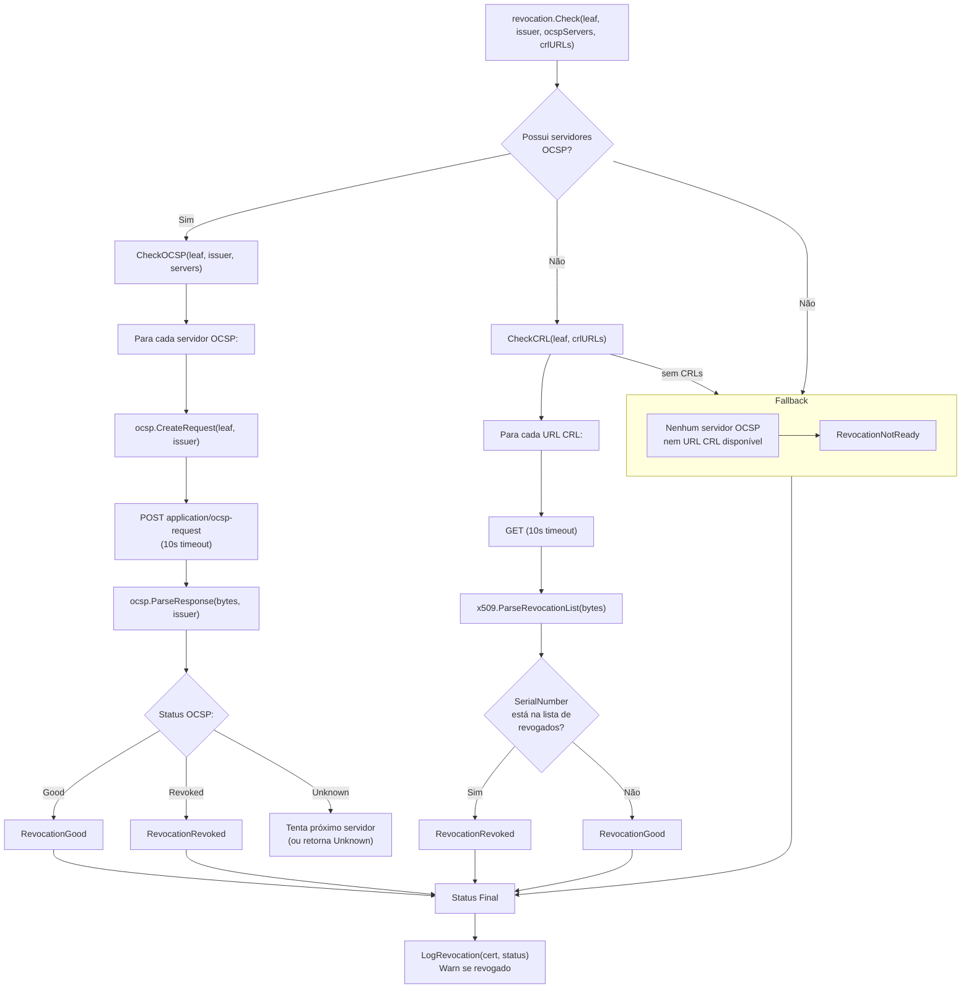

### Prioridade da Checagem

1. **OCSP** (Online Certificate Status Protocol) — tentativa primária, mais rápida e precisa
2. **CRL** (Certificate Revocation List) — fallback quando OCSP não está disponível ou retorna `NotReady`
3. **NotReady** — quando não há servidores OCSP nem URLs CRL no certificado

---

## Modelo de Dados — Certificate

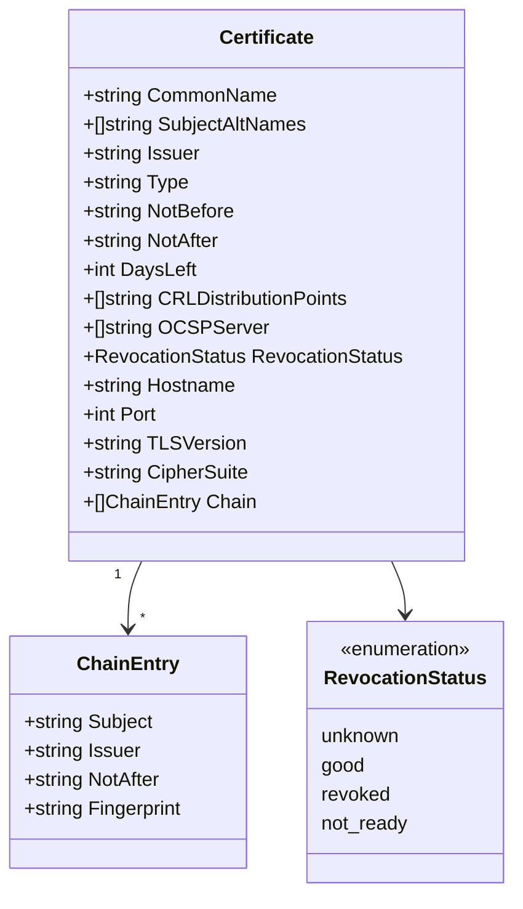

---

## Estrutura de Diretórios

```
certificate-validate/
├── cmd/certificate-validate/
│   └── main.go                    # Entry point
├── config/
│   └── settings.yml               # Configuração YAML
├── docs/
│   ├── swagger.yaml               # OpenAPI 3.0
│   └── ARCHITECTURE.md            # Este documento
├── internal/
│   ├── api/                       # Interface HTTP
│   │   ├── api.go                 # Handlers + middleware + rate limiter
│   │   └── static/                # Frontend embutido (embed)
│   ├── certificate/               # Domínio
│   │   ├── certificate.go         # VO + FromX509 + BuildChain
│   │   └── errors.go              # Erros de domínio
│   ├── checker/                   # Caso de uso
│   │   └── checker.go             # Checker (orquestração)
│   ├── cmd/                       # CLI (Cobra)
│   │   ├── root.go                # Comando raiz + flags globais
│   │   ├── check.go               # check + watch
│   │   ├── serve.go               # serve + buildDeps + startBackground
│   │   ├── export.go              # export JSON/CSV
│   │   └── version.go             # version
│   ├── config/                    # Configuração
│   │   └── config.go              # Load + Validate + applyEnvOverrides
│   ├── fetcher/                   # Provedor TLS
│   │   └── fetcher.go             # Fetcher interface + tlsFetcher
│   ├── formatter/                 # Provedor de formatação
│   │   └── formatter.go           # Formatter, FormatTable, FormatJSON, FormatCSV
│   ├── history/                   # Histórico
│   │   └── history.go             # Store, Recorder, rotacao JSONL
│   ├── metrics/                   # Métricas Prometheus
│   │   └── metrics.go             # Gauges + Handler
│   ├── notifier/                  # Webhook
│   │   └── notifier.go            # Notifier + alerta
│   ├── revocation/                # Revogação
│   │   └── revocation.go          # OCSP + CRL checks
│   └── service/                   # Serviço (facade)
│       └── service.go             # CertService
├── Dockerfile
├── docker-compose.yml
├── Makefile
└── README.md
```
