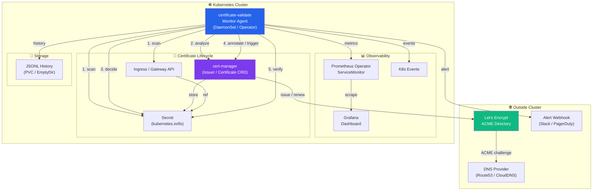
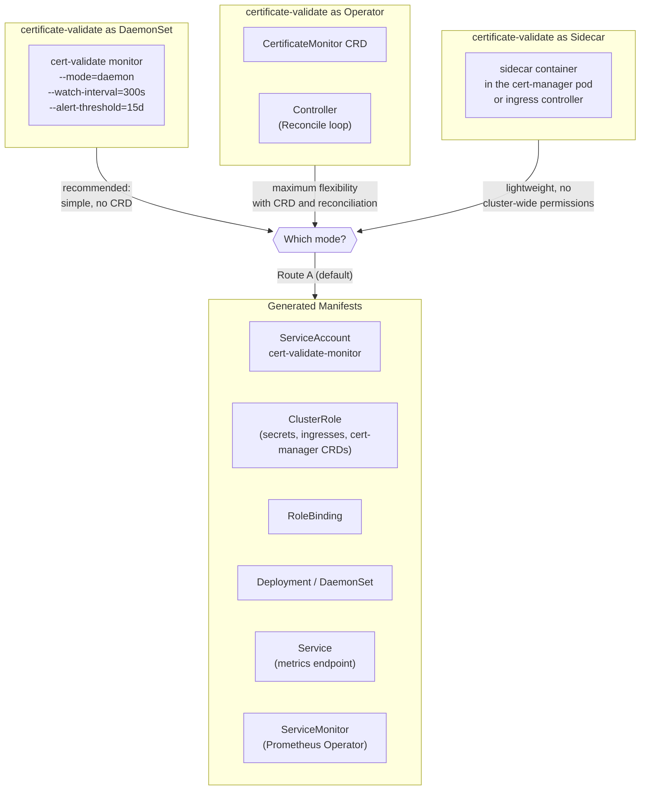
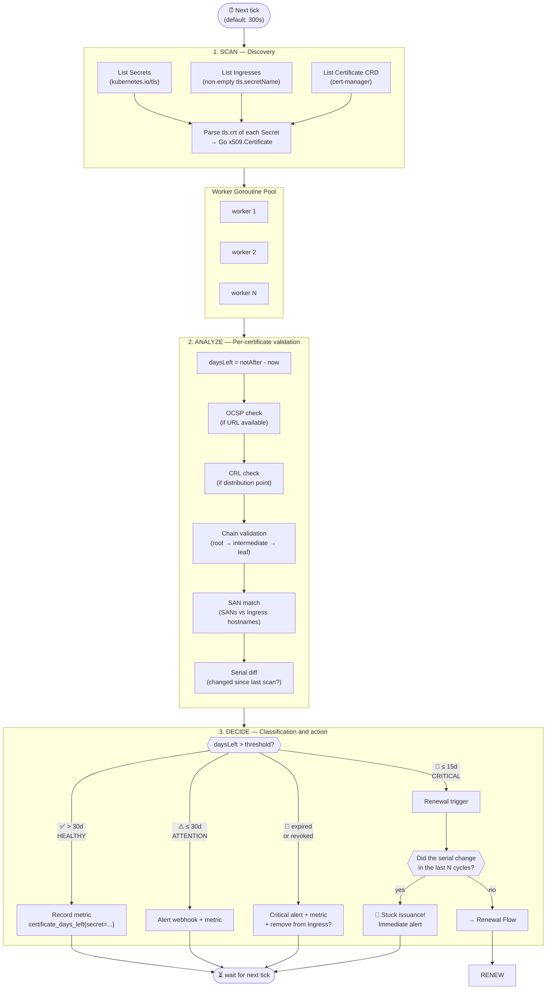
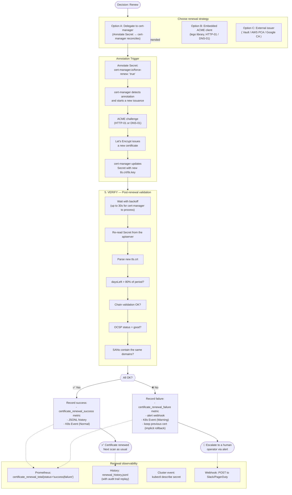
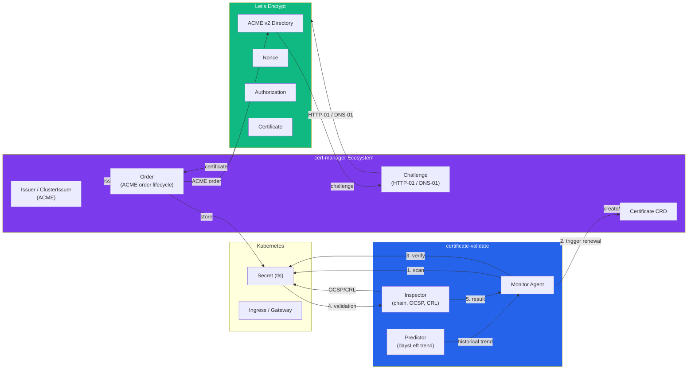
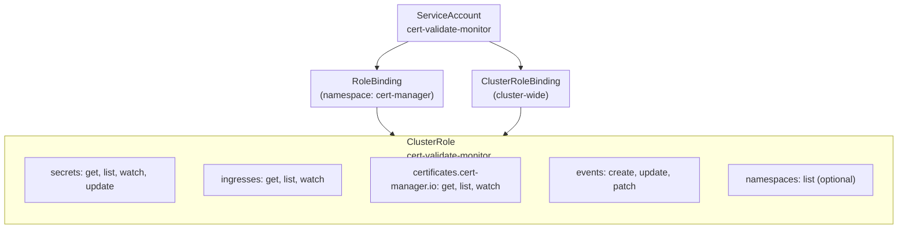
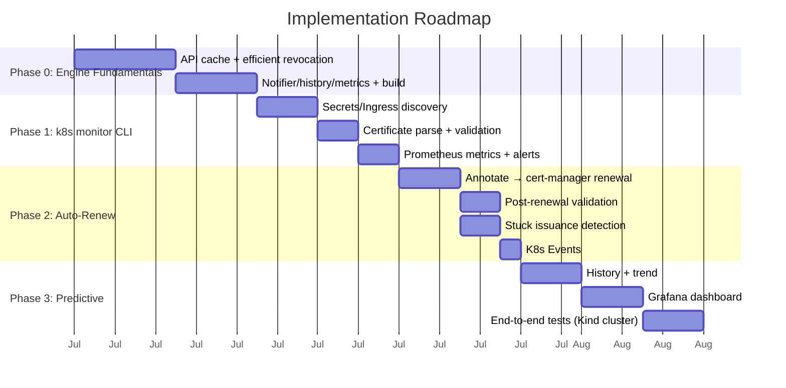

# Kubernetes Integration — Certificate Monitoring and Automatic Renewal

This document describes how **certificate-validate** can act as a monitoring, validation,
and automated renewal agent for TLS certificates in Kubernetes clusters, integrated with
Let's Encrypt and the CNCF ecosystem.

---

## Table of Contents

1. [Overview](#1-overview)
2. [Cluster Topology](#2-cluster-topology)
3. [Monitoring Flow (SCAN → ANALYZE → DECIDE)](#3-monitoring-flow-scan--analyze--decide)
4. [Auto-Renewal Flow (RENEW → VERIFY)](#4-auto-renewal-flow-renew--verify)
5. [Integration with cert-manager and Let's Encrypt](#5-integration-with-cert-manager-and-lets-encrypt)
6. [Deployment Model](#6-deployment-model)
7. [RBAC and Permissions](#7-rbac-and-permissions)
8. [Extended Data Model](#8-extended-data-model)
9. [Metrics and Alerts](#9-metrics-and-alerts)
10. [Route Decisions](#10-route-decisions)

---

## 1. Overview



The **certificate-validate** agent operates as an **intelligent watchdog** over the
certificate lifecycle in the cluster. It doesn't replace cert-manager — on the contrary,
it uses cert-manager as the renewal mechanism and fills the gaps in **visibility,
post-renewal validation, and predictive alerting**.

---

## 2. Cluster Topology



### Mode Matrix

| Mode | Scope | Required RBAC | Complexity | Use case |
|------|-------|---------------|------------|----------|
| **DaemonSet** | Cluster-wide | ClusterRole (secrets, ingress) | Low | General monitoring, alerting |
| **Operator** | Namespace + CRD | ClusterRole + CRD permissions | High | Full automation with renewal via annotation |
| **Sidecar** | Local pod | Local ServiceAccount | Minimal | Only validating one specific ingress |

---

## 3. Monitoring Flow (SCAN → ANALYZE → DECIDE)



> **Scale note:** steps A2 (OCSP) and A3 (CRL) reuse the core revocation module. The
> viability of scanning at scale (N secrets × OCSP/CRL responders) depends on
> **Phase 0**: short timeouts, OCSP response cache, and parallelism — without it, the
> revocation cost dominates the cycle. See [§10](#10-route-decisions) and `docs/WHY.md` §8.

### Decision Logic (pseudocode)

```go
type Decision struct {
    Action        ActionType // None, Warn, Renew, Critical
    Reason        string
    DaysLeft      int
    NeedsRenewal  bool
    StuckIssuance bool
}

func Decide(cert *Certificate, threshold int) *Decision {
    switch {
    case cert.DaysLeft <= 0:
        return &Decision{Action: Critical, Reason: "expired"}
    case cert.DaysLeft <= 7:
        return &Decision{Action: Renew, Reason: "critical low"}
    case cert.DaysLeft <= 15:
        // serial equal to the last scan? could be stuck
        if cert.Serial == lastSerial[cert.Name] {
            return &Decision{Action: Renew, Reason: "stuck issuance", StuckIssuance: true}
        }
        return &Decision{Action: Renew, Reason: "approaching expiry"}
    case cert.DaysLeft <= 30:
        return &Decision{Action: Warn, Reason: "attention"}
    default:
        return &Decision{Action: None, Reason: "healthy"}
    }
}
```

---

## 4. Auto-Renewal Flow (RENEW → VERIFY)



### Renewal Logic (pseudocode)

```go
type RenewalStrategy int

const (
    DelegateCertManager RenewalStrategy = iota // default
    EmbeddedACME
    ExternalIssuer
)

func (m *Monitor) Renew(ctx context.Context, secret *corev1.Secret) error {
    log := m.logger.With("secret", secret.Name, "namespace", secret.Namespace)

    // Step 1: Annotate to force renewal via cert-manager
    if secret.Annotations == nil {
        secret.Annotations = make(map[string]string)
    }
    secret.Annotations["cert-manager.io/force-renew"] = "true"

    _, err := m.clientset.CoreV1().Secrets(secret.Namespace).Update(ctx,
        secret, metav1.UpdateOptions{})
    if err != nil {
        return fmt.Errorf("annotate secret for renewal: %w", err)
    }
    log.Info("annotated secret for renewal")

    // Step 2: Wait for cert-manager to process (with timeout)
    backoff := wait.Backoff{
        Duration: 2 * time.Second,
        Factor:   1.5,
        Jitter:   0.5,
        Steps:    10, // ~2 minutes total
    }

    var renewedSecret *corev1.Secret
    err = wait.ExponentialBackoff(backoff, func() (bool, error) {
        s, err := m.clientset.CoreV1().Secrets(secret.Namespace).Get(ctx,
            secret.Name, metav1.GetOptions{})
        if err != nil {
            return false, err
        }
        // Serial changed = certificate renewed
        renewedSecret = s
        oldSerial := getSerial(secret.Data["tls.crt"])
        newSerial := getSerial(s.Data["tls.crt"])
        return newSerial != "" && newSerial != oldSerial, nil
    })
    if err != nil {
        return fmt.Errorf("wait for renewal: %w (timeout)", err)
    }

    // Step 3: Verify sanity of the new certificate
    cert, err := m.parseCertificate(renewedSecret)
    if err != nil {
        return fmt.Errorf("parse renewed certificate: %w", err)
    }

    if cert.DaysLeft < 80 {
        return fmt.Errorf("renewed certificate only has %d days (expected 90)", cert.DaysLeft)
    }

    // Post-renewal validation (STRICT semantics):
    // requires RevocationGood; unavailable OCSP/CRL is not accepted.
    status := m.revocation.Check(cert.Leaf, cert.Issuer, cert.OCSPServer, cert.CRLDistributionPoints)
    if status != RevocationGood {
        return fmt.Errorf("renewed certificate revocation status: %s (expected good)", status)
    }

    m.metrics.RenewalSuccess(secret.Namespace, secret.Name)
    m.recorder.Event(renewedSecret, corev1.EventTypeNormal, "CertRenewed",
        fmt.Sprintf("Certificate renewed, %d days left", cert.DaysLeft))
    return nil
}
```

> **Semantics decision:** post-renewal validation is **strict** — if the OCSP responder
> is unavailable or returns `unknown`, the renewal is treated as a failure (implicit
> rollback: the previous certificate is kept). This is only reliable with the revocation
> **Phase 0**: short timeouts, retry, OCSP response cache, and parallelism — otherwise,
> a latency spike from the responder produces a false negative. See [§10](#10-route-decisions) and
> the backlog in `docs/WHY.md` §8.

---

## 5. Integration with cert-manager and Let's Encrypt



### Responsibility Mapping

| Responsibility | Owner | How |
|---|---|---|
| Certificate issuance | cert-manager | ACME Issuer + Certificate CRD |
| Automatic renewal | cert-manager | Default: 30 days before expiry |
| **Forced renewal trigger** | **certificate-validate** | Annotate `cert-manager.io/force-renew` |
| **Post-renewal validation** | **certificate-validate** | Chain, OCSP, CRL, SANs |
| **Stuck issuance detection** | **certificate-validate** | Serial unchanged after N attempts |
| **Threshold alerting** | **certificate-validate** | Webhook + metrics + K8s Event |
| **daysLeft trend** | **certificate-validate** | JSONL history + simple regression |
| **Multi-cluster visibility** | **certificate-validate** | REST API + Swagger |
| Dashboard | Grafana | ServiceMonitor + exported metrics |

---

## 6. Deployment Model

### 6.1 DaemonSet (recommended mode)

```yaml
apiVersion: apps/v1
kind: DaemonSet
metadata:
  name: cert-validate-monitor
  namespace: cert-manager
  labels:
    app.kubernetes.io/name: certificate-validate
spec:
  selector:
    matchLabels:
      app.kubernetes.io/name: certificate-validate
  template:
    metadata:
      labels:
        app.kubernetes.io/name: certificate-validate
      annotations:
        prometheus.io/scrape: "true"
        prometheus.io/port: "9102"
    spec:
      serviceAccountName: cert-validate-monitor
      containers:
      - name: monitor
        image: certificate-validate:k8s
        args:
          - k8s
          - monitor
          - --watch-interval=300
          - --alert-threshold=15
          - --renew-threshold=10
          - --enable-auto-renew
          - --issuer-name=letsencrypt-prod
          - --issuer-kind=ClusterIssuer
          - --metrics-addr=:9102
          - --history-file=/data/history.jsonl
        ports:
        - containerPort: 9102
          name: metrics
        volumeMounts:
        - name: data
          mountPath: /data
        resources:
          requests:
            cpu: 50m
            memory: 64Mi
          limits:
            cpu: 200m
            memory: 256Mi
        securityContext:
          allowPrivilegeEscalation: false
          readOnlyRootFilesystem: true
          runAsNonRoot: true
          runAsUser: 65534
      volumes:
      - name: data
        emptyDir: {}
```

### 6.2 ServiceMonitor (Prometheus Operator)

```yaml
apiVersion: monitoring.coreos.com/v1
kind: ServiceMonitor
metadata:
  name: cert-validate-monitor
  namespace: cert-manager
spec:
  selector:
    matchLabels:
      app.kubernetes.io/name: certificate-validate
  endpoints:
  - port: metrics
    interval: 30s
    path: /metrics
  namespaceSelector:
    matchNames:
    - cert-manager
```

### 6.3 Service

```yaml
apiVersion: v1
kind: Service
metadata:
  name: cert-validate-monitor
  namespace: cert-manager
  labels:
    app.kubernetes.io/name: certificate-validate
spec:
  selector:
    app.kubernetes.io/name: certificate-validate
  ports:
  - name: metrics
    port: 9102
    targetPort: 9102
```

---

## 7. RBAC and Permissions



### Full manifest

```yaml
---
apiVersion: v1
kind: ServiceAccount
metadata:
  name: cert-validate-monitor
  namespace: cert-manager
---
apiVersion: rbac.authorization.k8s.io/v1
kind: ClusterRole
metadata:
  name: cert-validate-monitor
rules:
- apiGroups: [""]
  resources: ["secrets"]
  verbs: ["get", "list", "watch", "update"]
- apiGroups: ["networking.k8s.io"]
  resources: ["ingresses"]
  verbs: ["get", "list", "watch"]
- apiGroups: ["cert-manager.io"]
  resources: ["certificates", "certificates/status", "issuers", "clusterissuers"]
  verbs: ["get", "list", "watch", "update"]
- apiGroups: [""]
  resources: ["events"]
  verbs: ["create", "update", "patch"]
- apiGroups: [""]
  resources: ["namespaces"]
  verbs: ["get", "list"]
---
apiVersion: rbac.authorization.k8s.io/v1
kind: ClusterRoleBinding
metadata:
  name: cert-validate-monitor
subjects:
- kind: ServiceAccount
  name: cert-validate-monitor
  namespace: cert-manager
roleRef:
  kind: ClusterRole
  name: cert-validate-monitor
  apiGroup: rbac.authorization.k8s.io
```

---

## 8. Extended Data Model

```go
// Extension of the current Certificate struct for K8s support
type K8sCertificate struct {
    Certificate                       // embedding of the existing model

    // K8s metadata
    K8sNamespace   string             `json:"k8s_namespace"`
    K8sName        string             `json:"k8s_name"`
    K8sKind        string             `json:"k8s_kind"`       // Secret | Ingress | CertificateCRD
    K8sAPIVersion  string             `json:"k8s_api_version"`
    K8sAnnotations map[string]string  `json:"k8s_annotations,omitempty"`
    K8sLabels      map[string]string  `json:"k8s_labels,omitempty"`

    // Renewal state
    RenewalState     RenewalState    `json:"renewal_state"`
    LastRenewal      *time.Time      `json:"last_renewal,omitempty"`
    LastRenewalError string          `json:"last_renewal_error,omitempty"`
    RenewalAttempts  int             `json:"renewal_attempts"`
    StuckSince       *time.Time      `json:"stuck_since,omitempty"` // serial unchanged since

    // Issuer info
    IssuerRefName    string `json:"issuer_ref_name"`
    IssuerRefKind    string `json:"issuer_ref_kind"` // Issuer | ClusterIssuer
    IssuerRefGroup   string `json:"issuer_ref_group"`

    // Computed metrics
    SerialNumber     string   `json:"serial_number"`
    PreviousSerial   string   `json:"previous_serial,omitempty"`
    RenewalCount     int      `json:"renewal_count"`
    StuckCount       int      `json:"stuck_count,omitempty"` // number of times it got stuck
}

type RenewalState string

const (
    RenewalStateNone      RenewalState = "none"
    RenewalStatePending   RenewalState = "pending"
    RenewalStateInProgress RenewalState = "in_progress"
    RenewalStateSuccess   RenewalState = "success"
    RenewalStateFailed    RenewalState = "failed"
    RenewalStateStuck     RenewalState = "stuck"
)
```

### History Schema (extension of the existing JSONL)

```jsonl
{"ts":"2026-07-01T10:00:00Z","host":"api.example.com","daysLeft":45,"k8s_namespace":"production","k8s_secret":"api-tls","serial":"a1b2c3","renewal_state":"none"}
{"ts":"2026-07-15T10:00:00Z","host":"api.example.com","daysLeft":30,"k8s_namespace":"production","k8s_secret":"api-tls","serial":"a1b2c3","renewal_state":"pending","renewal_attempt":1}
{"ts":"2026-07-15T10:02:00Z","host":"api.example.com","daysLeft":90,"k8s_namespace":"production","k8s_secret":"api-tls","serial":"d4e5f6","renewal_state":"success","renewal_count":1,"ocsp_status":"good"}
```

---

## 9. Metrics and Alerts

### 9.1 Exported Prometheus Metrics

| Metric | Type | Labels | Description |
|--------|------|--------|-------------|
| `certificate_days_left` | Gauge | `namespace`, `secret`, `hostname`, `issuer` | Days left until certificate expiry |
| `certificate_renewal_total` | Counter | `namespace`, `secret`, `status` | Renewal counter (success/failure) |
| `certificate_renewal_duration_seconds` | Histogram | `namespace`, `secret` | Duration of the renewal cycle |
| `certificate_renewal_attempts` | Gauge | `namespace`, `secret` | Attempt count of the current renewal |
| `certificate_stuck_issuance` | Gauge | `namespace`, `secret` | 1 if the serial hasn't changed in the last N cycles |
| `certificate_expired` | Gauge | `namespace`, `secret` | 1 if expired, 0 otherwise |
| `certificate_total` | Gauge | `namespace` | Total monitored certificates |
| `certificate_revoked` | Gauge | `namespace`, `secret`, `method` | 1 if OCSP or CRL reports revoked |

> **Unified names** with the existing `internal/metrics` package in the core
> (`certificate_days_left`, `certificate_expired` — see `internal/metrics/metrics.go`).
> The new metrics in this section follow the same `certificate_` prefix. Phase 1 **extends**
> the existing package rather than creating a parallel registry. Without this, the
> PrometheusRules below would never match the real gauges.

### 9.2 Alerts (PrometheusRule)

```yaml
apiVersion: monitoring.coreos.com/v1
kind: PrometheusRule
metadata:
  name: cert-validate-alerts
  namespace: cert-manager
spec:
  groups:
  - name: certificate-validate
    rules:
    - alert: CertificateExpiringSoon
      expr: certificate_days_left < 15
      for: 5m
      labels:
        severity: warning
      annotations:
        summary: "Certificate {{ $labels.secret }} expiring in {{ $value }} days"
        description: "Secret {{ $labels.namespace }}/{{ $labels.secret }} ({{ $labels.hostname }}) expires in {{ $value }} days"

    - alert: CertificateExpired
      expr: certificate_days_left <= 0
      for: 1m
      labels:
        severity: critical
      annotations:
        summary: "Certificate {{ $labels.secret }} has expired"
        description: "Secret {{ $labels.namespace }}/{{ $labels.secret }} expired {{ $value }} days ago"

    - alert: CertificateRenewalFailed
      expr: certificate_renewal_total{status="failure"} > 1
      for: 5m
      labels:
        severity: critical
      annotations:
        summary: "Certificate renewal failed for {{ $labels.secret }}"
        description: "Renewal has failed {{ $value }} times for {{ $labels.namespace }}/{{ $labels.secret }}"

    - alert: CertificateStuckIssuance
      expr: certificate_stuck_issuance == 1
      for: 10m
      labels:
        severity: critical
      annotations:
        summary: "Certificate {{ $labels.secret }} issuance is stuck"
        description: "Serial number has not changed for {{ $labels.namespace }}/{{ $labels.secret }} across multiple scan cycles"

    - alert: CertificateRevoked
      expr: certificate_revoked == 1
      for: 1m
      labels:
        severity: critical
      annotations:
        summary: "Certificate {{ $labels.secret }} has been revoked"
        description: "OCSP/CRL reports {{ $labels.secret }} as revoked"
```

### 9.3 Grafana Dashboard (panel suggestions)

```
┌──────────────────────────────────────────────────────────────┐
│  🔐 Certificate Health Overview                               │
├─────────────────┬─────────────────┬──────────────────────────┤
│ Total Certs     │ At Risk (≤15d)  │ Expired / Revoked        │
│     142         │       3         │        0                 │
├─────────────────┴─────────────────┴──────────────────────────┤
│ 📈 Certificates by Days Left (bar chart / namespace)          │
├──────────────────────────────────────────────────────────────┤
│ 🕒 Renewal Timeline (recent success/failures)                 │
├──────────────────────────────────────────────────────────────┤
│ ⚠️ Alert Table: certs < 30d + stuck + revoked                │
└──────────────────────────────────────────────────────────────┘
```

### 9.4 Security prerequisites (serve mode)

When the agent exposes the REST API (`serve`) or the metrics endpoint, the hardening
measures from the engineering backlog (`docs/WHY.md` §8.2) apply:

- **Constant-time API key comparison** (`crypto/subtle`) and dashboard sending
  `X-API-Key` — today enabling `api_key` breaks the UI (frontend fetches get 401).
- **Per-IP rate limiter** (per-client bucket), not a shared global bucket — a single
  client must not be able to exhaust the quota for everyone else.
- **Security headers** on the dashboard (CSP, Referrer-Policy, Permissions-Policy).
- **Probes pointing at `/health`** (with a short cache), never at
  `/api/v1/cert/info/all` — the current health endpoint dials every host on each call;
  an unreachable host would fail the probe and restart the pod/container.

---

## 10. Route Decisions

| Route | Effort | Value | Risk | External dependency |
|-------|--------|-------|------|---------------------|
| **A: cert-manager + our agent as monitor/alert** | Low (days) | High | Low | cert-manager (already standard in most clusters) |
| **B: Full operator with CRD + renewal** | High (weeks) | Very high | Medium | None besides K8s |
| **C: Embedded ACME client (lego library)** | Medium | High | Medium | None (own code) |
| **D: CLI `k8s monitor` command** | Low | Medium | Low | None |

### Recommended strategy: Route A + D

```
Phase 0 ──── Engine Fundamentals ─────────────── Effort: 1-2 weeks
  ├── API result cache (TTL = check_time)
  ├── Efficient revocation (ctx, short timeouts, parallel OCSP+CRL, cache)
  ├── Parallel notifier (reuse CheckAll)
  ├── Indexed history (incremental rotation + in-memory index)
  ├── No-stale metrics (DeleteLabelValues)
  ├── Fetcher with tls.Dialer/DialContext
  ├── Constant-time auth + per-IP rate limit + security headers
  └── Unified CSV export (CLI = API)
  ──→ Prerequisite for Phases 1-3 (details in docs/WHY.md §8)

Phase 1 ──── `k8s monitor` command (CLI) ─────── Effort: days
  ├── Reads TLS Secrets from the cluster via client-go
  ├── Analyzes validity, chain, OCSP, CRL
  ├── Exports Prometheus metrics with K8s labels
  ├── Fires webhook alerts (already implemented)
  └── Grand Finale: kubectl cert-validate monitor

Phase 2 ──── Auto-renew via cert-manager ─────── Effort: 1-2 weeks
  ├── Detects certs near expiry (≤15d)
  ├── Annotate Secret → cert-manager re-issues
  ├── Post-renewal validation (chain, OCSP, CRL)
  ├── Detects stuck issuance (serial unchanged)
  └── K8s Events at every step

Phase 3 ──── Predictive + Dashboard ──────────── Effort: 1-2 weeks
  ├── History → daysLeft trend (linear regression)
  ├── Expiry vs renewal forecast
  ├── Failure pattern detection
  └── Grafana dashboard + ServiceMonitor
```



The deployment manifests (`DaemonSet`, `ServiceAccount`, `ClusterRole`, `PrometheusRule`,
`ServiceMonitor`) and the skeleton of the `k8s monitor` command can be generated directly
from the repository — the Kubernetes client (`client-go`) would already be the only new
external dependency.

> **Phase 0 (Engine Fundamentals) is a prerequisite for Phases 1–3** — without API cache
> and efficient revocation, the scan at scale and strict post-renewal validation
> (semantics of §4) aren't viable. The detailed backlog is in
> [`docs/WHY.md`](WHY.md#8-engineering-fundamentals-backlog) §8.
