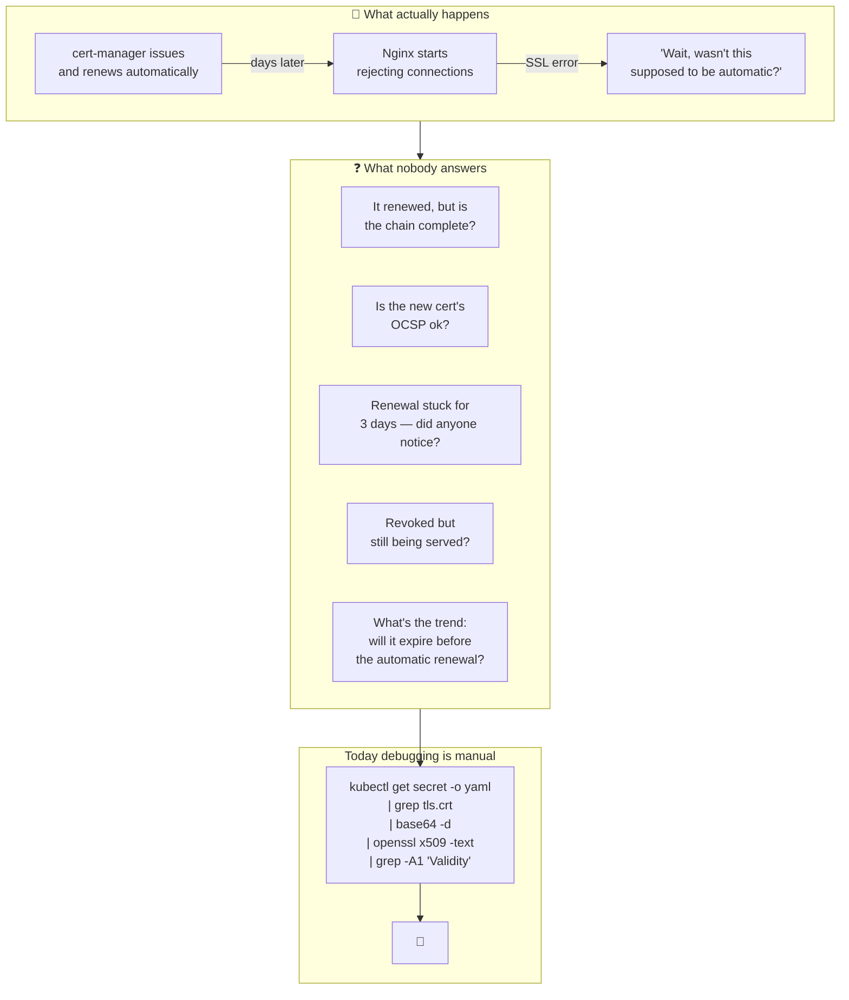
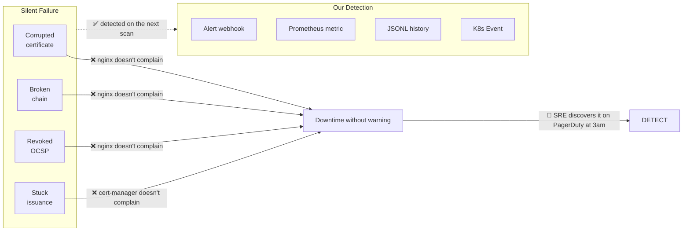
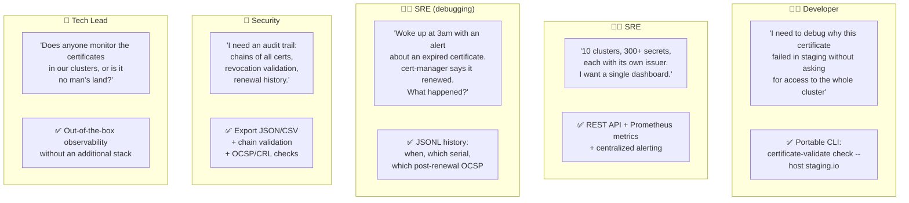
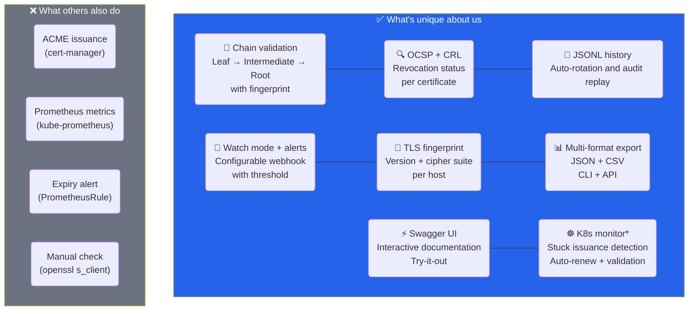
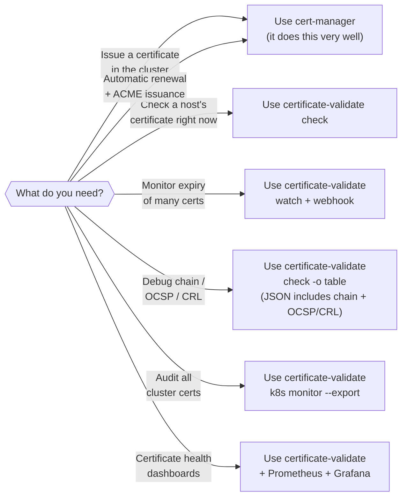
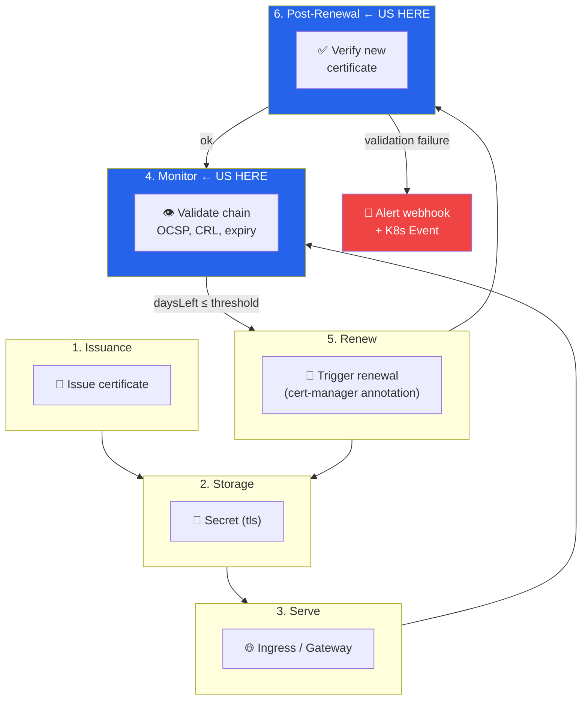

# Why certificate-validate?

This document articulates the problem we solve, for whom, and why our
approach differs from what already exists in the ecosystem.

---

## Table of Contents

1. [The Problem](#1-the-problem)
2. [Who It's For](#2-who-its-for)
3. [What Makes Us Different](#3-what-makes-us-different)
4. [Comparison with the Ecosystem](#4-comparison-with-the-ecosystem)
5. [Anti-Patterns: What We Don't Do](#5-anti-patterns-what-we-dont-do)
6. [The Real Niche](#6-the-real-niche)
7. [The Complete Certificate Lifecycle](#7-the-complete-certificate-lifecycle)
8. [Engineering Fundamentals (Backlog)](#8-engineering-fundamentals-backlog)

---

## 1. The Problem



### 1.1 The false sense of security

The `cert-manager` renewed the certificate? Yes.
The Secret was updated? Yes.
The Ingress is serving the new certificate? Yes.

**But:**

- What if the chain came back incomplete? Android clients may reject it.
- What if the new certificate's OCSP is revoked? nginx doesn't validate — traffic keeps flowing.
- What if the renewal request got stuck on DNS-01 and the serial has been the same for 3 days?
- What if the certificate expired today and nobody noticed because the browser cache still works?

Each of these questions requires **manual intervention**. In clusters with 50+ TLS secrets
spread across dozens of namespaces, this diagnosis scales as technical debt.

### 1.2 The cost of invisibility



---

## 2. Who It's For

### 2.1 Personas



### 2.2 Pain Matrix

| Persona | Pain | Our solution | Replaces? |
|---------|------|--------------|-----------|
| **Dev** | Debugging without cluster access | `check --host staging.io` CLI | `openssl` + `kubectl` |
| **SRE** | Multi-cluster without unified visibility | API + Prometheus + Alerts | Prometheus + Grafana **partially** |
| **SRE** | Incident without traceability | JSONL history + metrics | cert-manager logs **partially** |
| **Security** | Chain and revocation audit | `export --format json` + OCSP/CRL | Manual scripts |
| **Tech Lead** | "Who owns the certificates?" | Dashboard + Swagger + README | Nothing — new problem |

---

## 3. What Makes Us Different



### 3.1 No one else connects these dots

`cert-manager` does issuance and renewal. `kube-prometheus` does metrics. `openssl` does manual checking.

**Nobody does all three together, with history and configurable alerting, in a single ~12MB binary.**

```
With cert-manager + Prometheus + scripts:
  ├── 3 different stacks
  ├── 2 configuration systems
  ├── Data that can't be correlated
  └── Debugging = manually cross-referencing logs

With certificate-validate:
  ├── 1 binary
  ├── 1 configuration (YAML + env vars)
  ├── Correlated data (history + metrics + alerts)
  └── Debugging = API + Swagger + JSONL replay
```

---

## 4. Comparison with the Ecosystem

### 4.1 Feature Comparison Table

| Feature | `openssl` | `cert-manager` | Prometheus + Alerts | Us |
|---|---|---|---|---|
| Local CLI check | ✅ | ❌ | ❌ | ✅ |
| Continuous watch mode | ❌ | ❌ | ✅ | ✅ |
| Chain validation | ❌ | ❌ | ❌ | ✅ |
| OCSP check | ✅ (manual) | ❌ | ❌ | ✅ |
| CRL check | ✅ (manual) | ❌ | ❌ | ✅ |
| History with auto-rotation | ❌ | ❌ | ❌ | ✅ |
| Webhook alert | ❌ | ❌ | ❌ | ✅ |
| JSON/CSV export | ❌ | ❌ | ❌ | ✅ |
| Swagger UI | ❌ | ❌ | ❌ | ✅ |
| REST API | ❌ | ✅ (K8s API) | ❌ | ✅ |
| Prometheus metrics | ❌ | ✅ | ✅ | ✅ |
| ACME auto-renew | ❌ | ✅ | ❌ | ❌* |
| Stuck issuance detection | ❌ | ❌ | ❌ | ✅* |
| Post-renewal validation | ❌ | ❌ | ❌ | ✅* |

_* being implemented in the K8s integration_

### 4.2 When to Use What



### 4.3 The Phrase That Sums It Up

> **"cert-manager handles issuance. We handle the rest."**

---

## 5. Anti-Patterns: What We Don't Do

It's as important to know what we **aren't** as what we are.

| Anti-Pattern | Why we don't do it |
|---|---|
| **Issuing certificates** | cert-manager does this with decades of battle-testing. Duplicating it would be insane. |
| **Replacing Prometheus** | Exponential metrics are an established pattern. We integrate with it. |
| **Managing Ingress** | We don't touch routes — we only monitor the linked certs. |
| **Being a CA** | We don't sign CSRs or issue root CAs. Our business is inspection. |
| **Reverse proxy** | We don't terminate TLS. We only validate what's already being served. |

```
┌─────────────────────────────────────────────────────┐
│                                                     │
│   We are in the VALIDATION LAYER, not in the        │
│   issuance layer nor the serving layer.             │
│                                                     │
│   Issuance:   cert-manager / Vault / LE             │
│   Serving:    nginx / Envoy / Gateway API           │
│   Validation: ← certificate-validate (here)         │
│                                                     │
└─────────────────────────────────────────────────────┘
```

---

## 6. The Real Niche

### 6.1 The Sweet Spot

Our tool is ideal for:

```
Teams that:
  ✅ Already use cert-manager (or want to)
  ✅ Have 5+ TLS secrets spread across namespaces
  ✅ Have been surprised by an expired certificate
  ✅ Want visibility without building a stack from scratch
  ✅ Prefer a Go single binary over chained scripts

But not for:
  ❌ Teams that don't use K8s and have 2 certificates
  ❌ Teams that already have well-configured Prometheus + Grafana + alerts
    (much is already covered — but chain/OCSP/stuck is still missing)
```

### 6.2 Where We Really Win

```
Full stack without us:            Stack with certificate-validate:
┌──────────────────────┐          ┌──────────────────────┐
│  cert-manager        │          │  cert-manager        │
│  Prometheus Operator │          │  Prometheus Operator │
│  Grafana             │          │  Grafana             │
│  PrometheusRule      │          │  PrometheusRule      │
│  kubectl + openssl   │          │  certificate-validate│
│  custom scripts      │          └──────────────────────┘
│  control spreadsheet │          (replaces: scripts +
└──────────────────────┘           spreadsheet + manual openssl)
```

We don't replace Prometheus/Grafana. **We replace the fragile glue people assemble with
scripts, `kubectl`, and `openssl | grep`.**

### 6.3 The Value in Numbers

| Scenario | Without us | With us |
|---|---|---|
| Diagnose a broken chain | 15-30 min (kubectl + openssl + decode) | 2 sec (`check --host`) |
| Audit 50 certificates | 2h (script + spreadsheet) | 1 min (`export --format json`) |
| Set up certificate monitoring | 2 days (Prometheus + alerts + dashboard) | 5 min (`k8s monitor`) |
| Debug a stuck renewal | 1h (cert-manager logs + manual comparison) | 10s (`certificate_stuck_issuance` metric) |
| Check OCSP for 100 hosts | not feasible manually | 1 watch cycle (300s) † |

† *Depends on Phase 0 of revocation efficiency: short timeouts, OCSP response cache, and
parallelism — today the module queries each responder with a 10s timeout, serialized and
without cache. See [Section 8](#8-engineering-fundamentals-backlog).*

---

## 7. The Complete Certificate Lifecycle



> **Steps 4 and 6 are no man's land in the current ecosystem.**
> Everyone covers 1-3 and 5. Nobody covers continuous and post-renewal validation.

---

## 8. Engineering Fundamentals (Backlog)

> The positioning above only holds if the core delivers scale and reliability.
> Below is the improvement backlog identified in the code review (Aug 2026),
> prioritized by impact. The K8s roadmap phases depend on these improvements —
> see [`docs/K8S_INTEGRATION.md`](K8S_INTEGRATION.md#10-route-decisions).

### 8.1 Performance and Scale

| # | Improvement | Impact |
|---|-------------|--------|
| 1 | **API result cache** (TTL = `check_time`, stale-if-error) | Today every request redoes TLS + OCSP for all hosts and writes history; dashboard/ServiceMonitor polling degrades the API |
| 2 | **Efficient revocation**: propagate ctx, short timeouts (2–3s), parallel OCSP + CRL, OCSP response cache | 10s per server, serialized and without cache, makes "100 hosts per cycle" (§6.3) infeasible |
| 3 | **Indexed history** (in-memory host → entries index, incremental rotation) | `readAll()` O(n) on every write degrades with the rich schema planned in the K8s roadmap |
| 4 | **Parallel notifier** (reuse `CheckAll`) | Serial checking delays alerts with many hosts |
| 5 | **Fetcher with `tls.Dialer`/`DialContext`** | Stuck dial doesn't respond to context cancellation; fragile type assertion in `NewWithPerHostCAs` |

### 8.2 Security and Reliability

| # | Improvement | Impact |
|---|-------------|--------|
| 6 | **Constant-time auth** (`crypto/subtle`) + dashboard sends `X-API-Key` | String comparison is a timing attack vector; today enabling `api_key` breaks the UI |
| 7 | **Per-IP rate limiter** (per-client bucket, configurable) | A global bucket lets one client consume the quota and deny service to everyone else |
| 8 | **Correct healthcheck** (`/health` with short cache) | Compose points at an expensive endpoint; a down monitored host → restart loop |
| 9 | **No-stale metrics** (`DeleteLabelValues` for removed hosts) | Orphan gauges pollute dashboards and alerts |
| 10 | **Security headers** (CSP, Referrer-Policy, Permissions-Policy) | Hardens the dashboard at no cost |

### 8.3 Quality and Build

| # | Improvement | Impact |
|---|-------------|--------|
| 11 | **Unified CSV export** (CLI and API, same schema) | Two different formats for the same resource |
| 12 | **Docker**: `.dockerignore`, build cache, `go.mod`/`go.sum` before `COPY . .` | Context ships `.git`/`data/`; code changes invalidate the module cache |
| 13 | **CI**: fuzzing jobs (`go test -fuzz`) | Fuzz tests exist but never run in CI |
| 14 | **Cleanup**: duplicate `Flush()` in the API CSV export, dead `HasExpired`, indentation in `serve.go` | Maintenance |
| 15 | **Config**: table-driven env overrides + invalid-value warning; `PortInt()` without swallowing errors | Config errors are silent today |
| 16 | **Observability**: log 429 requests | Rate-limited requests are invisible in logs |
| 17 | **Docs**: commit this doc and the K8s roadmap | Vision and roadmap out of version control |
| 18 | **Default config**: consistent `settings.yml` (`debug: true`, `environment`) | Inconsistent defaults |

### 8.4 Alignment Decisions

| Decision | Where it applies |
|----------|------------------|
| Metric names unified with the existing `internal/metrics` package (`certificate_*` prefix) | K8s roadmap §9 |
| Post-renewal validation uses **strict** OCSP semantics (requires `good`); Phase 0 of revocation is a prerequisite | K8s roadmap §4 |

---

## Summary

```txt
┌─────────────────────────────────────────────────────────────────┐
│                                                                 │
│   certificate-validate is the VALIDATION LAYER that's missing   │
│   between issuance (cert-manager) and serving (Ingress).        │
│                                                                 │
│   We don't issue. We don't serve. We validate.                  │
│                                                                 │
│   The only ones on the market offering:                         │
│   ├── Chain validation + OCSP + CRL in a single command         │
│   ├── Watch mode + threshold alerts + JSONL history             │
│   ├── Stuck issuance detection (K8s)*                           │
│   ├── Automatic post-renewal validation (K8s)*                  │
│   └── ~12MB replacing kubectl + openssl + scripts               │
│       + spreadsheet                                             │
│                                                                 │
│   *planned for the K8s integration — not implemented            │
│                                                                 │
└─────────────────────────────────────────────────────────────────┘
```
