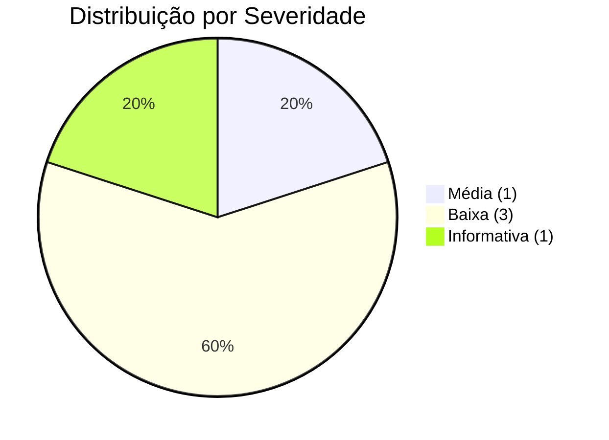
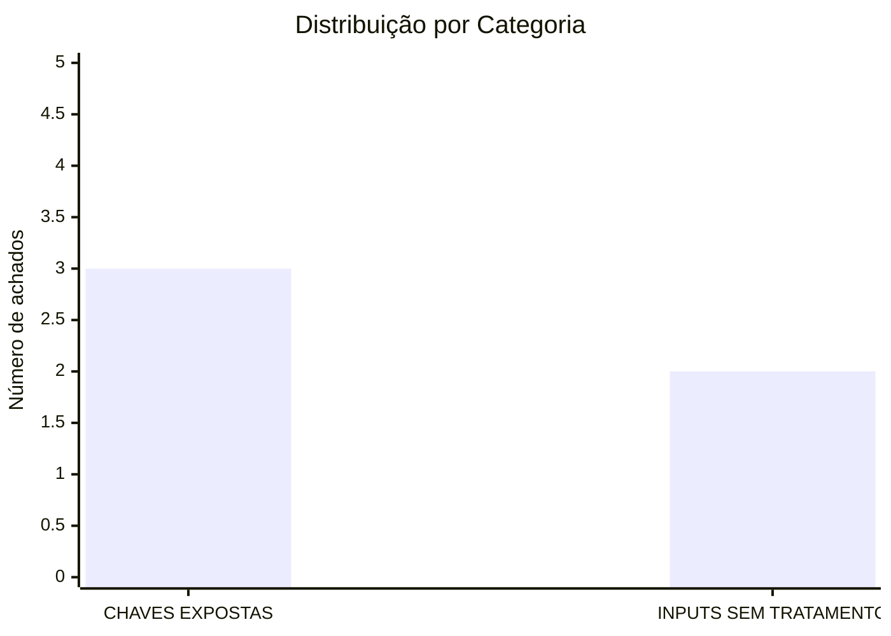

# Relatório de Auditoria de Segurança

## certificate-validate

**Data:** 29 de agosto de 2026  
**Escopo:** Auditoria de segurança completa adaptada à stack Go/Cobra/net/http  
**Versão auditada:** v1.0.4

---

## Metodologia

Esta auditoria foi realizada adaptando as 5 categorias padrão de segurança à stack específica do projeto:

- **Linguagem:** Go 1.27
- **Framework CLI:** Cobra
- **Framework HTTP:** net/http (stdlib)
- **Autenticação:** API Key via header X-API-Key
- **Frontend:** Vanilla JS embutido (app.js)
- **Deploy:** Docker, Kubernetes, Helm

### Categorias adaptadas:

1. **BANCO SEM TRANCA** → Não aplicável (projeto não tem multi-tenancy)
2. **PERMISSÃO DEFINIDA NO NAVEGADOR** → Não aplicável (não há sistema de roles/admin)
3. **IDOR** → Não aplicável (API apenas lê dados de configuração, não há objetos por ID)
4. **CHAVES EXPOSTAS** → Verificado: API keys, secrets em configs, CI/CD
5. **INPUTS SEM TRATAMENTO (XSS)** → Verificado: frontend JS, templates, outputs

---

## Resumo Executivo

### Total de achados: 5





### Severidades:
- 🔴 **Crítica:** 0
- 🟠 **Alta:** 0
- 🟡 **Média:** 1
- 🔵 **Baixa:** 3
- ⚪ **Informativa:** 1

---

## Pontos Fortes ✅

O projeto demonstra implementação sólida de várias práticas de segurança:

1. **Rate limiting implementado**
   - Token bucket com 100 req/s e burst 200 previne abuso e DoS básico
   - _Evidência:_ `internal/api/api.go:24-58`

2. **Security headers configurados**
   - X-Content-Type-Options: nosniff e X-Frame-Options: DENY
   - _Evidência:_ `internal/api/api.go:327-328`

3. **XSS mitigado com esc() consistente**
   - Função esc() usa createTextNode() do DOM para escapar HTML
   - _Evidência:_ `internal/api/static/app.js:553-557`

4. **Container Docker roda como non-root**
   - Usuário appuser (UID 1000) reduz impacto de comprometimento
   - _Evidência:_ `Dockerfile:12, 19`

5. **Timeout de contexto em health checks**
   - context.WithTimeout(5s) previne hang em hosts inacessíveis
   - _Evidência:_ `internal/api/api.go:260-261`

6. **Hot-reload seguro com atomic.Value**
   - Swap atômico do handler previne race conditions
   - _Evidência:_ `internal/cmd/serve.go:62-63, 151`

7. **CSV export com UTF-8 BOM**
   - BOM UTF-8 garante compatibilidade com Excel
   - _Evidência:_ `internal/api/api.go:187-190`

---

## Pontos Fracos ⚠️

Os principais riscos identificados são:

1. **Comparação de API key vulnerável a timing attack** (Média)
2. **Escaping inconsistente no frontend** (Baixa)
3. **Ausência de validação de startup para API sem auth** (Baixa)
4. **Documentação insuficiente sobre configuração segura** (Informativa)

---

## Achados Detalhados

### SEC-001: Comparação de API key vulnerável a timing attack

| Campo | Valor |
|-------|-------|
| **Severidade** | 🟡 Média |
| **Categoria** | CHAVES EXPOSTAS |
| **Arquivo** | `internal/api/api.go:332` |

**Descrição:**  
A comparação de strings usando `!=` em Go não é constante no tempo, permitindo que um atacante determine o valor correto da API key medindo o tempo de resposta de múltiplas requisições.

**Código:**
```go
if r.Header.Get("X-API-Key") != h.apiToken {
```

**Impacto:**  
Um atacante pode recuperar a API key caractere por caractere através de análise estatística do tempo de resposta, especialmente em redes de baixa latência.

**Explorabilidade:**  
Requer rede de baixa latência e múltiplas requisições. Mais fácil em ambientes locais ou com acesso direto à rede.

**Correção sugerida:**  
Usar `crypto/subtle.ConstantTimeCompare` para comparação segura contra timing attacks.

---

### SEC-002: Função escAttr() não escapa caracteres < e >

| Campo | Valor |
|-------|-------|
| **Severidade** | 🔵 Baixa |
| **Categoria** | INPUTS SEM TRATAMENTO (XSS) |
| **Arquivo** | `internal/api/static/app.js:559-561` |

**Descrição:**  
A função escAttr() apenas escapa aspas, mas não escapa < e >. Se um valor de certificado (issuer, commonName) contiver tags HTML, pode ser injetado em atributos title.

**Código:**
```javascript
function escAttr(str) {
    return str.replace(/"/g, '&quot;').replace(/'/g, '&#39;');
}
```

**Impacto:**  
XSS armazenado potencial se um certificado malicioso for monitorado. O atacante precisaria controlar um servidor com certificado adulterado.

**Explorabilidade:**  
Requer que o usuário monitore um host com certificado malicioso controlado pelo atacante. Baixa probabilidade em uso normal.

**Correção sugerida:**  
Adicionar escape de < e > na função escAttr():
```javascript
return str.replace(/&/g, '&amp;')
          .replace(/</g, '&lt;')
          .replace(/>/g, '&gt;')
          .replace(/"/g, '&quot;')
          .replace(/'/g, '&#39;');
```

---

### SEC-003: Valor cert.port não é escapado no modal

| Campo | Valor |
|-------|-------|
| **Severidade** | 🔵 Baixa |
| **Categoria** | INPUTS SEM TRATAMENTO (XSS) |
| **Arquivo** | `internal/api/static/app.js:251` |

**Descrição:**  
O valor cert.port é inserido diretamente no HTML sem escaping. Embora port seja um número inteiro vindo do backend, a falta de escaping consistente é uma prática insegura.

**Código:**
```javascript
'<span class="detail-value">' + cert.port + '</span>'
```

**Impacto:**  
Se o backend for comprometido ou houver um bug que permita string em port, poderia resultar em XSS.

**Explorabilidade:**  
Impraticável no estado atual, pois port é validado como inteiro no backend. É uma questão de defesa em profundidade.

**Correção sugerida:**  
Usar esc() para todos os valores:
```javascript
esc(String(cert.port))
```

---

### SEC-004: Ausência de validação de startup para API key padrão

| Campo | Valor |
|-------|-------|
| **Severidade** | 🔵 Baixa |
| **Categoria** | CHAVES EXPOSTAS |
| **Arquivo** | `internal/cmd/serve.go:202-205` |

**Descrição:**  
O servidor inicia sem API key se nenhuma for configurada. Não há validação de startup que avise ou rejeite configuração sem autenticação em ambientes de produção.

**Código:**
```go
apiToken := apiKeyFlag
if apiToken == "" {
    apiToken = cfg.APIKey
}
```

**Impacto:**  
Deploy acidental sem autenticação pode expor dados de certificados a qualquer pessoa com acesso à rede.

**Explorabilidade:**  
Requer misconfiguration no deploy. O comportamento é documentado, mas pode passar despercebido.

**Correção sugerida:**  
Adicionar warning no startup se apiToken == "" em ambiente production, ou exigir configuração explícita via flag `--allow-insecure`.

---

### SEC-005: Kubernetes Deployment não configura API key como Secret

| Campo | Valor |
|-------|-------|
| **Severidade** | ⚪ Informativa |
| **Categoria** | CHAVES EXPOSTAS |
| **Arquivo** | `kubernetes/Deployment.yml:28-48` |

**Descrição:**  
O manifest Kubernetes não demonstra como configurar a API key via Secret. Usuários podem não perceber que precisam criar um Secret separado.

**Código:**
```yaml
env:
  - name: ENVIRONMENT
    valueFrom:
      configMapKeyRef: ...
```

**Impacto:**  
Documentação insuficiente pode levar a deploys sem autenticação.

**Explorabilidade:**  
Não é uma vulnerabilidade direta, mas uma lacuna de documentação que pode levar a misconfiguration.

**Correção sugerida:**  
Adicionar exemplo de Secret e volume mount no Deployment.yml ou na documentação.

---

## Recomendações Priorizadas

### P1 - Alta Prioridade
- **Implementar comparação constante para API key** usando `crypto/subtle.ConstantTimeCompare`

### P2 - Média Prioridade
- **Melhorar função escAttr()** para escapar todos os caracteres especiais HTML

### P3 - Baixa Prioridade
- **Adicionar escaping consistente** em todos os valores do frontend (incluindo cert.port)
- **Adicionar warning no startup** quando API não tem autenticação configurada

### P4 - Documentação
- **Documentar configuração de API key** via Kubernetes Secret nos manifests de exemplo

---

## Issues para o GitHub

Abaixo estão os textos completos das issues prontas para copiar e colar no GitHub.

---

### --- ISSUE 1 ---

**Título:** [Segurança] Comparação de API key vulnerável a timing attack  
**Labels:** `security`, `medium`

**Descrição:**

A comparação de API key no middleware de autenticação usa o operador `!=` diretamente, o que não é constante no tempo. Isso permite que um atacante determine o valor correto da API key medindo o tempo de resposta de múltiplas requisições (timing attack).

**Evidência:**

Arquivo: `internal/api/api.go:332`

```go
if r.Header.Get("X-API-Key") != h.apiToken {
```

**Impacto:**

Um atacante com acesso à rede pode recuperar a API key caractere por caractere através de análise estatística do tempo de resposta. O risco é maior em:
- Redes de baixa latência (mesma LAN)
- Ambientes com alta precisão de timing
- APIs com alto volume de requisições

**Sugestão de Correção:**

Usar `crypto/subtle.ConstantTimeCompare` para comparação segura:

```go
import "crypto/subtle"

// No middleware:
expected := []byte(h.apiToken)
provided := []byte(r.Header.Get("X-API-Key"))
if subtle.ConstantTimeCompare(expected, provided) != 1 {
    // unauthorized
}
```

**Critérios de Aceite:**

- [ ] Importar `crypto/subtle`
- [ ] Substituir comparação `!=` por `subtle.ConstantTimeCompare`
- [ ] Adicionar teste unitário verificando que tempos de resposta são constantes
- [ ] Documentar a mudança no CHANGELOG

### --- FIM ISSUE 1 ---

---

### --- ISSUE 2 ---

**Título:** [Segurança] Melhorar escaping de atributos HTML no frontend  
**Labels:** `security`, `low`

**Descrição:**

A função `escAttr()` no frontend JavaScript não escapa os caracteres `<` e `>`, apenas aspas. Além disso, alguns valores (como `cert.port`) são inseridos sem escaping em certas partes do modal.

**Evidência:**

Arquivo: `internal/api/static/app.js:559-561`

```javascript
function escAttr(str) {
    return str.replace(/"/g, '&quot;').replace(/'/g, '&#39;');
}
```

Arquivo: `internal/api/static/app.js:251`

```javascript
'<span class="detail-value">' + cert.port + '</span>'
```

**Impacto:**

XSS armazenado potencial se um certificado malicioso for monitorado. O atacante precisaria controlar um servidor com certificado adulterado contendo payloads HTML nos campos (issuer, commonName, etc).

**Probabilidade:** Baixa, pois requer:
1. Usuário monitorando host controlado pelo atacante
2. Certificados com payloads específicos nos campos X.509

**Sugestão de Correção:**

1. Melhorar `escAttr()` para escapar todos os caracteres especiais:

```javascript
function escAttr(str) {
    return String(str)
        .replace(/&/g, '&amp;')
        .replace(/</g, '&lt;')
        .replace(/>/g, '&gt;')
        .replace(/"/g, '&quot;')
        .replace(/'/g, '&#39;');
}
```

2. Usar `esc()` para `cert.port` e outros valores não escapados:

```javascript
'<span class="detail-value">' + esc(String(cert.port)) + '</span>'
```

**Critérios de Aceite:**

- [ ] Atualizar `escAttr()` para escapar `<`, `>`, e `&`
- [ ] Revisar todos os usos de `innerHTML` e garantir escaping consistente
- [ ] Adicionar teste manual com certificado contendo `<script>alert(1)</script>` nos campos
- [ ] Considerar usar `textContent` ao invés de `innerHTML` onde possível

### --- FIM ISSUE 2 ---

---

### --- ISSUE 3 ---

**Título:** [Segurança] Adicionar validação de startup para API sem autenticação  
**Labels:** `security`, `low`, `documentation`

**Descrição:**

O servidor inicia sem autenticação se nenhuma API key for configurada. Não há warning no startup ou validação que previna deploys acidentais sem autenticação em ambientes de produção.

Além disso, os manifests Kubernetes de exemplo não demonstram como configurar a API key via Secret.

**Evidência:**

Arquivo: `internal/cmd/serve.go:202-205`

```go
apiToken := apiKeyFlag
if apiToken == "" {
    apiToken = cfg.APIKey
}
```

Arquivo: `kubernetes/Deployment.yml` - não configura API key

**Impacto:**

Deploy acidental sem autenticação pode expor dados de certificados (hostnames, emissores, datas de expiração) a qualquer pessoa com acesso à rede.

**Probabilidade:** Média, especialmente em:
- Deploys rápidos sem revisão de configuração
- Ambientes de desenvolvimento promovidos para produção
- Falta de documentação clara sobre autenticação

**Sugestão de Correção:**

1. Adicionar warning no startup quando `apiToken == ""`:

```go
if apiToken == "" {
    slog.Warn("API server starting WITHOUT authentication. " +
              "Set api_key in config or use --api-key flag. " +
              "Use --allow-insecure to suppress this warning.")
}
```

2. Adicionar flag `--allow-insecure` para suppressir o warning explicitamente.

3. Atualizar `kubernetes/Deployment.yml` com exemplo de Secret:

```yaml
# Criar Secret:
# kubectl create secret generic certificate-validate-api-key \
#   --from-literal=API_KEY=your-secret-key

env:
  - name: CV_API_KEY
    valueFrom:
      secretKeyRef:
        name: certificate-validate-api-key
        key: API_KEY
```

4. Atualizar documentação (README, site) com seção "Security Considerations".

**Critérios de Aceite:**

- [ ] Adicionar warning no startup quando API key não configurada
- [ ] Adicionar flag `--allow-insecure` para suppressir warning
- [ ] Atualizar `kubernetes/Deployment.yml` com exemplo de Secret
- [ ] Adicionar seção "Security" no README.md
- [ ] Atualizar site com guia de configuração de autenticação

### --- FIM ISSUE 3 ---

---

## Conclusão

O projeto **certificate-validate** demonstra boas práticas de segurança em sua arquitetura e implementação. Os achados identificados são principalmente de severidade baixa e informativa, relacionados a melhorias de defesa em profundidade e documentação.

A implementação de rate limiting, security headers, container não-root, e escaping consistente no frontend são pontos fortes significativos. As recomendações priorizadas focam em:

1. **P1:** Corrigir a comparação de API key (timing attack)
2. **P2:** Melhorar o escaping no frontend
3. **P3-P4:** Adicionar validações de startup e melhorar documentação

A implementação dessas melhorias elevará ainda mais o nível de segurança do projeto, tornando-o mais robusto contra ataques sofisticados e prevenindo misconfigurations em produção.

---

**Relatório gerado em:** 29 de agosto de 2026  
**Auditor:** Análise automatizada de segurança  
**Método:** Revisão de código estático adaptada à stack Go/HTTP
